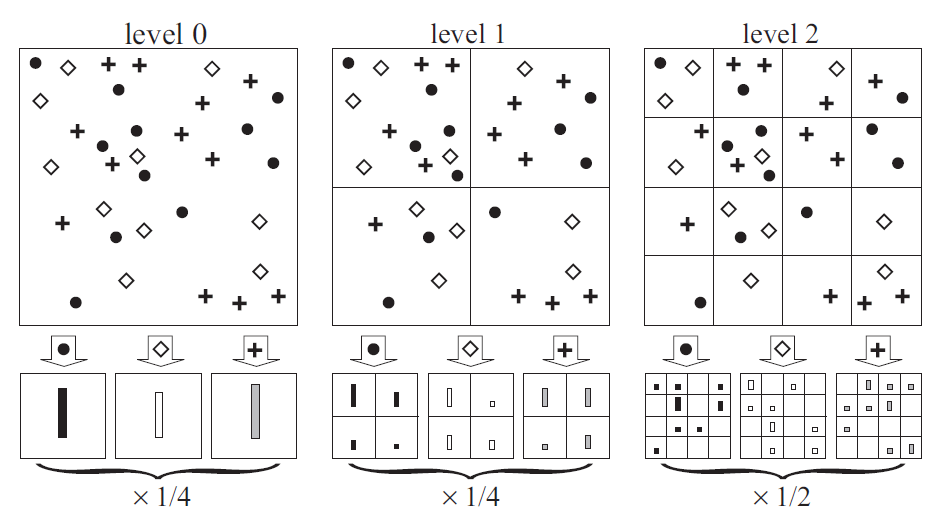

# Beyond Bags of Features: Spatial Pyramid Matching for Recognizing Natural Scene Categories

## Introduction

This paper presents a method for recognizing scene categories based on approximate global geometric correspondence, so called "spatial pyramid".

## Method

1. *Pyramid Match Kernels*
	- Placing a sequence of increasingly coaser grids over the feature space and taking a weighted sum of the number of matches that occur at each level of resolution.
	- Matches found at finer resolution is given higher weight

2. *Feature Extraction*
	- Weak features
		- gradient in a given direction exceeds a threshold
	- Strong Features
		- SIFT descriptors of $16\times16$ pixel patches computed over a grid with spacing of 8 pixels
		- To deal with low-contrast regions, skip the usual SIFT normalization procedure when the overall gradient magnitude of the patch is too weak

## Results

Experimented on 3 datasets: fifteen scene categories, Caltech-101, and Graz

1. *Scene Category Recognition*

2. *Caltech-101*

3. *The Graz Dataset*

## Discussion

1. Very simple method and is able to be combined with other feature designed by hand for specific problems
2. Even though doesn't outperform well-designed bag-of-features, spatial pyramid could still provide useful discriminative information
3. Inspired lots of work, such as gist, SIFT, and lots of DNN designs.
