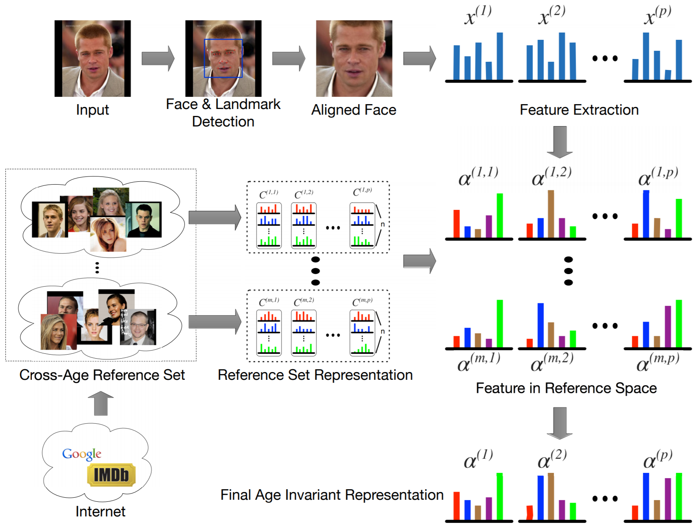
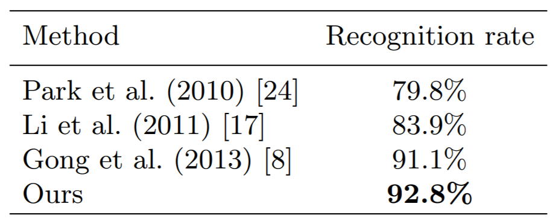
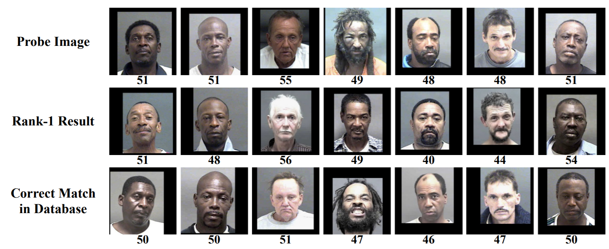

# Cross-Age Reference Coding for Age-Invariant Face Recognition and Retrieval

## Introduction

This paper focuses on the cross-age face recognition problem. It proposes a novel coding framework called Cross-Age Reference Coding (CARC). Further more, they introduce a large-scale dataset for face recognition and retrieval across age called Cross-Age Celebrity Dataset (CACD).

## Method

1. Detect and extract features from face landmarks
2. Average the reference set's features for each person in the same year at the same landmark
3. Calculate the best weights ($\alpha$) for aggregating references by solving a least squared problem with L2 regularizer
4. Use a tridiagonal matrix to smoothe out temporal relationship
5. Aggregate representaions across years with max pooling 

## Results

Acheives state-of-the-art performance on own dataset as well as MORPH dataset

The failed cases are hard to tell even for human

## Discussion

1. The idea of using a reference for cross-age recognition didn't came out from nothing, it came from other papers' idea, but they immigrated the idea to this problem, and it worked well.
2. Sometimes we don't need the top-1 accuracy to be very good, we only have 92.8% top-1 accuracy from this papers method, but for most application, we might only need top-k to be good enough. Looking at top-20, we could acheive 98% with the papers method.