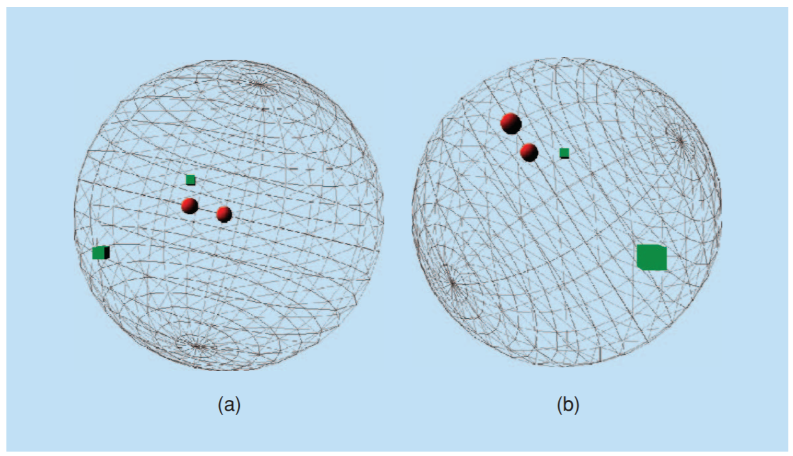

# Locality-Sensitive Hashing for Finding Nearest Neighbors

## Introduction

With the prosperity of the internet, we now have access to tons and tons of data, however we don't have the computation power to search through all the data by brute force. This lecture note describes a technique known as locality-sensitive hashing (LSH) that allows one to quickly find similar entries in large databases.

## Method

- Goal is to preserve locality after hashing using projections (such as the sphere above projecting to 2D space)
- Random projections
	- Random generate vectors from gaussain distribution, then quantize into buckets
	- Use $k$ dot products per hash, and $L$ independent projections
	- After projection, use double hash to speed up search with high probability

## Results

Many applications use LSH nowadays, due to its fast, efficient and robust performance, as well as easy implementation.

## Discussion

1. I don't have any experience with such big data set (Billions), but we should think bigger, since this might what we will meet when we work.
