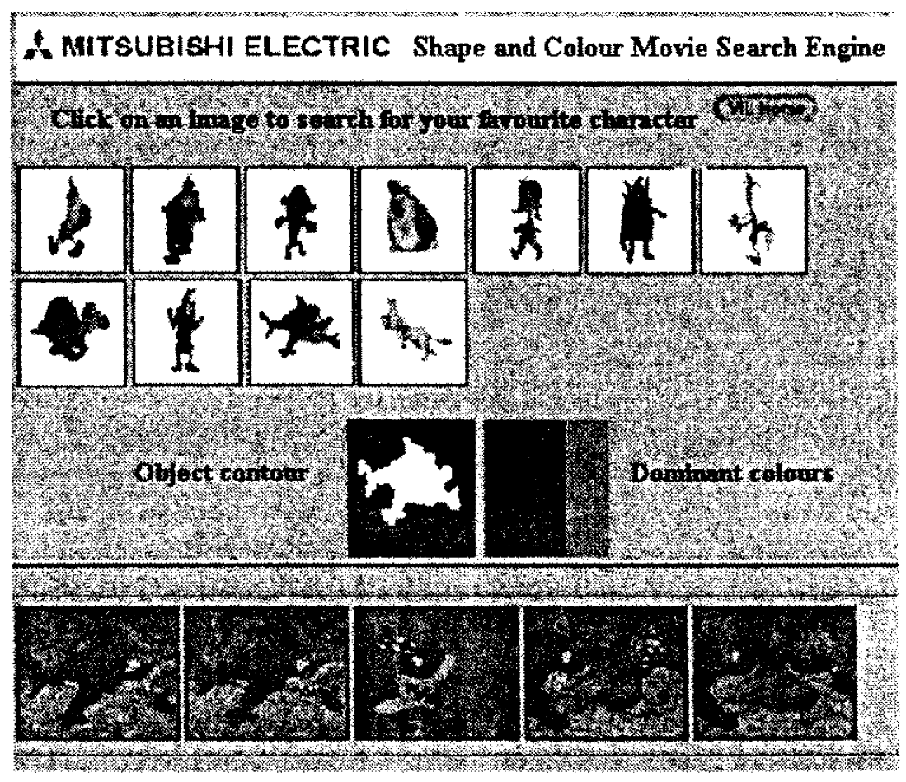

# MPEG-7 Visual Shape Descriptors

## Introduction

Shape feature provides a very powerful clue to object identity and functionality. MPEG-7 descriptors provides a set of versatile shape descriptors, supporting an entire spectrum of possible applications.

## Method

- *3-D Shape Descriptors*
	- Based on shape spectrum concept
- *Angular Radial Transformation (ART) -- Region-Based Shape Descriptors*
	- Compact and efficient way of describing multiple disjoint regions simultaneously
	- Could recover from mis-split regions
	- Robust to noise
- *Contour-Based Shape Descriptors*
	- Based on curvature scale-space (CSS) representation of the contour
	- Could distingusish shapes that have simmilar regions but different contour shape
	- Supports search for shapes that are semantically similar for humans
	- Robust to significant nonrigid deformations
	- Robust to distortions in the contour due to perspective
transformations
- *2D/3D Descriptors*
	- Used to combine 2D descriptors to represeent a visual feature of a 3D object seeing from different angles

## Results

Web-based video clip search application using MPEG-7 contour shape and dominant color descriptors

## Discussion

- Shape feature is important for object identification, could be used in a lot of applications
- Deep networks for any application that might need object shape as features could take these descriptors as an insight for designing networks