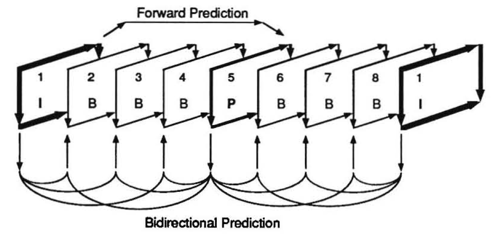

# MPEG: A Video Compression Standard for Multimedia Applications

## Introduction

Standardization of video compression techniques has become a high priority, MPEG aims to compress videos and its associated audio can be compressed to a bit rate about 1.5 Mbits/sec with acceptable quality.

## Method

- Development is divided into 3 phases: Requirements, Competition, Convergence
- Motion Compensation

- Spatial Redundancy Reduction
	- Digital Cosine Transformation(DCT)
	- Quantization
	- Entropy Coding
- Implementation of encoder and decoder is not defined, only the decoding process is, it is left for the manufacturers to design efficient encoder and decoder for their oen applications.

## Results

A general, fexible and efficient video compression standard is born. Widely used in the industry now. 

## Discussion

- The MPEG development had a very tight schedule, thus decided to figure out the requirements first.
- The competition-like development encourages a high variety of design from all different institutions, which result in a high quality standard.
- A lot of ideas were borrowed from previous work, such as JPEG, CCITT, when we do research, it is very important to look at what others have done before, and try to merge their idea into our own novel idea.
