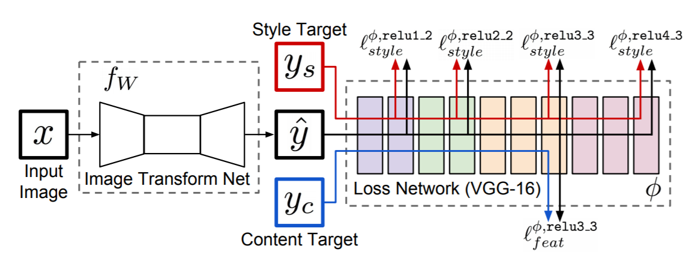

# Perceptual Losses for Real-Time Style Transfer and Super-Resolution

## Introduction

In image transformation tasks, per-pixel losses used by feed-forward networks do not capture perceptual differences between output and ground-truth images. Recent work has shown that high-quality images can be generated using perceptual loss functions, however, are slow since inference require solving an optimization problem. This paper combines the benefits of both approaches, by training a feed-forward network perceptual loss functions that depend on high-level features from a pretrained loss network.

## Method

1. *Image Transformation Networks*
- Fully convolution, use strided convolution to downsample and upsample
- Use residual connections

2. *Perceptual Loss Functions*
- Feature Reconstruction Loss
	- Instead of pixel-wise loss, pass output into a loss network(VGG-16 is used in this work), and compare the feature representation
	- When recontructing from higher layers, the overall spatial structure is preserved, but color, texture and exact shape are not
- Style Reconstruction Loss
	- Gram matrix
	- Squared Frobenius norm of the difference between the Gram matrices of the output and target images

## Results

1. *Style Transfer*

2. *Super Resolution*

## Discussion

1. Using a pretrained network to get feature representations, and calculate loss according to the feature rather than per-pixel loss
2. Multiple loss functions could be merged together to perform multi-task problems(reconstruct image and style transfer in this case)
3. The idea of perceptual loss could be used in other areas as well
