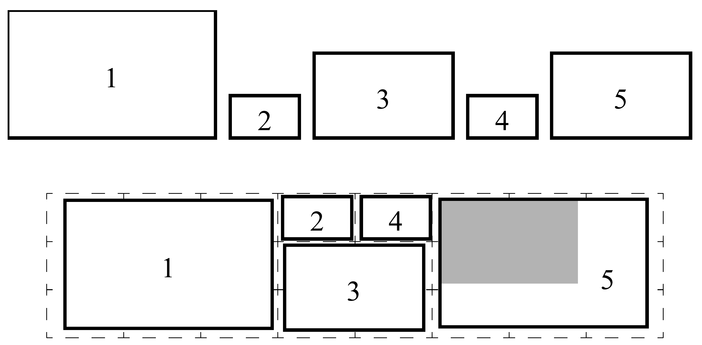

# Summarizing Video Using a Shot Importance Measure and a Frame-Packing Algorithm

## Introduction

This paper presents methods of generating compact pictorial summarizations of video.

## Method

1. *Measure Shot Importance*
- Find large frame difference that correspond to cuts, or shot boundaries
- Cluster the shots to a disired number of clusters.
- Normalized weight for cluster $i$
	- $W_i=\dfrac{S_i}{\sum\limits^C_{j=1}S_j}$
	- $S_i$ is the total length of all shots in cluster $i$
- Importance $I$ for shot $j$ from cluster $k$
	- A shot is important if it is both long and rare
	- $I_j=L_j\log{\dfrac{1}{W_k}}$
	- $L_j$ is the length of shot $j$

2. *Keyframe Packing Algorithm*

- Segment all frames into several blocks and search through the entire block for the best sequence of keyframes
- Run a packing algorithm that packs the keyframes into a compact picture (as the above figure)
- First decide the row height and find all frame sequences that fit the "row block" (by exhaustive search)
- Fit the sequence into the row block
	- $l=argmin(\dfrac{1}{n}\sum\limits^{n_i}_{j=1}c(f_{s+j-1}, q_{ij})+w_i$
	- $c(x, y)$ is the cost of placing frame of size $x$ with $y$ remaining space
	- $f_i$ is the size of frame $i$, size will be determined by the importance factor
	- $q_{ij}$ is the $j$th element of sequence **$q_i$**
	- $w_i$ is an addition weighting factor determined by the remaining space

## Results

## Discussion

1. More factors could be considered, such as close-up of a person sould be favorable, or other feature that we are interested in.
2. The Importance factor could be modified for our own design.
3. Only pictorical representation is produced by this algorithm, video summary (with audios) might be a good direction for future work (which is probably done by someone already today).
