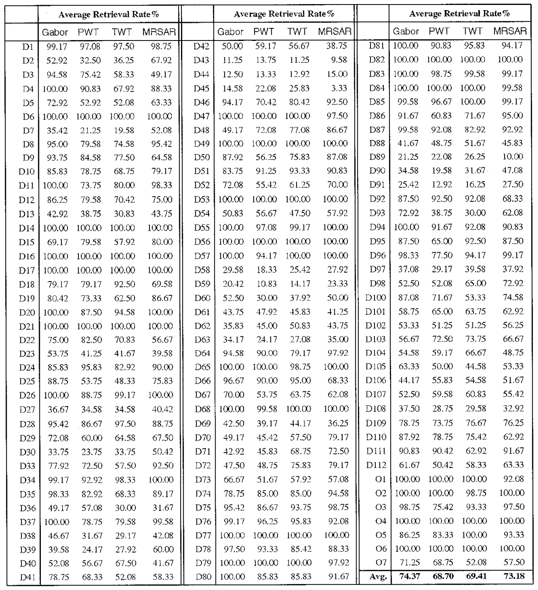
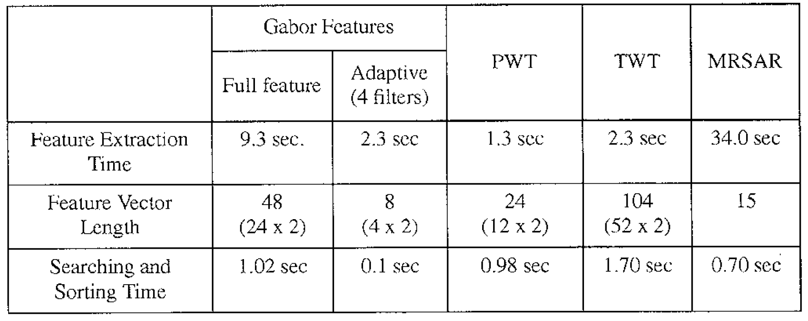

# Texture Features for Browsing and Retrieval of Image Data

## Introduction

Image content based retrieval is emerging as an important research area with application to digital libraries and multimedia databases. This paper proposes the use of Gabor wavelet features for texture analysis and provide a compirehensive experimental evaluation.

## Method

1. *Texture Feature Extraction*
- Gabor functions and wavelet
	- Complete but nonorthogonal basis set
- Gabor filter dictionary
	- Eliminate redundency by nonorthogonal basis
	- Design strategy is to ensure that the half-peak magnitude support of the filter responses in the frequency spectrum touch each other
- Feature representation
	- Feature vector constructed by $\mu_{mn}$ and $\sigma_{mn}$
	- Distance measured by normalized mean difference plus normalized standard deviation difference

2. *Adaptive Filter Selection*
- Tradeoff between performance and computation time
- Adaptively select filters based on total difference energy within its spectral coverage

## Results

1. Very comprehensive experiment evaluation

2. Comparison of computation time

## Discussion

1. Texture is important feature for a image, gabor filter is a good feature proved by very comprehensive experiments
2. Tradeoff between performance and time is always a big problem, this paper shown a very good example solution of this kind of problems
