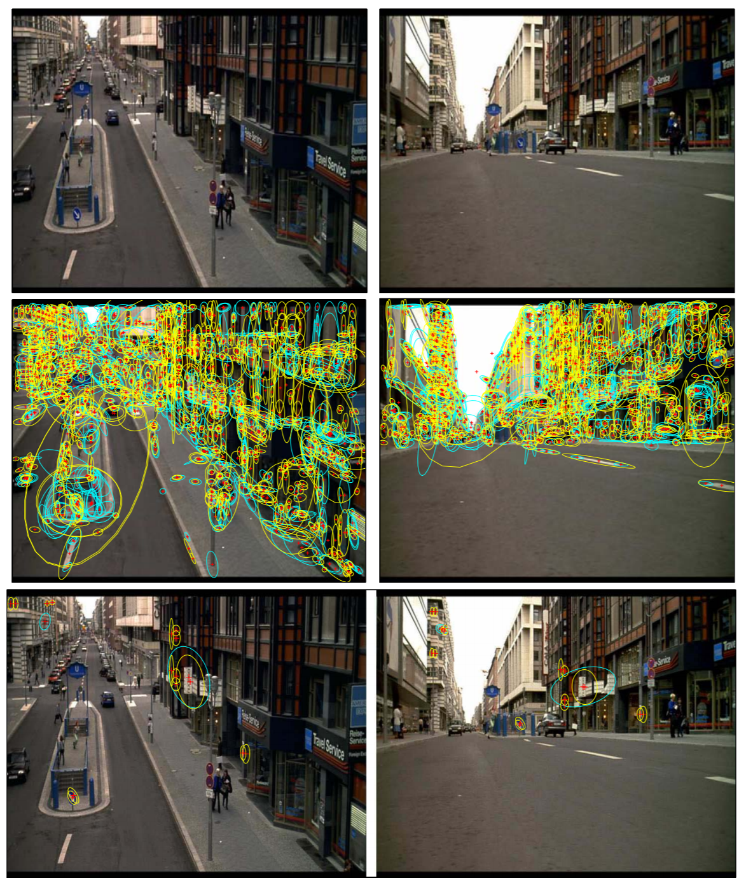

# Video Google: A Text Retrieval Approach to Object Matching in Videos

## Introduction:

The aim of this paper is to retrieve the key frames or shots of a video containing a particular object with ease, speed and accuracy. This paper investigates whether a text retrieval approach can be successfully employed for object recognition.

## Method:

1. *Viewpoint Invarient Descriptors*
- Shape Adapted (SA)
	- Iteratively determining the ellipse centre, scale and shape
	- Scale is determined by local extremum of a Laplacian
	- Shape is determined by maximizing intensity gradient isotropy over the ellipse region
- Maximally Stable (MS)
	- Approximately stationary for various intensity watershed image segmentation
- SIFT Descriptors
	- Each ellipse is then represented by a 128-dimension SIFT descriptor

2. *Building a Visual Vocabulary*
- Cluster descriptors into a smaller set of vocabulary
- Use them just like text retrieval methods
- Stop words (frequent words) are used just like text retrieval

## Results:

Object query example 

## Discussion:

1. Making an object retrieval into a text retrieval problem with embedding techniques is impressive.
2. How to deal with such a great amount of search space is difficult.
3. Object recognition is being researched a lot recently, and got a lot of breakthroughs, how could be blend the old techniques with the new ones?