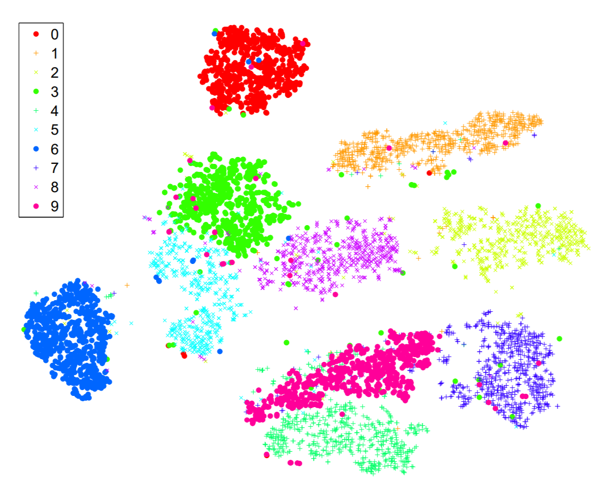

# Visualizing Data using t-SNE

## Introduction

Visualization of high-dimensional data is an important problem in many different domains. However, most techniques either cna't preserve locality due to linearity, or performs bad on visualizing real, high-dimension data. This paper describes a way of converting a high-dimensional data set into a matrix of pairwise similarities and we introduce a new technique, called “t-SNE.

## Method

1. Stocastic Neighbor Embedding
- Convcert high-dimensional Euclidean distances between data points into conditional probability that represents simlilarity.
- Focuses on retaining local structure
- Sensitive to initial amount of Gausian noise and the rate which it decays

2. t-Distributed Stochastic Neighbor Embedding
- Uses a symmetrized version of the SNE cost function with simpler gradients
- Uses a Student-t distribution rather than a Gaussian to compute the similarity between two points in the low-dimensional space.

## Results

## Discussion

1. t-SNE focuses on visualizing data, not simply dimension reduction only
2. Solves some problem that occurred with SNE
