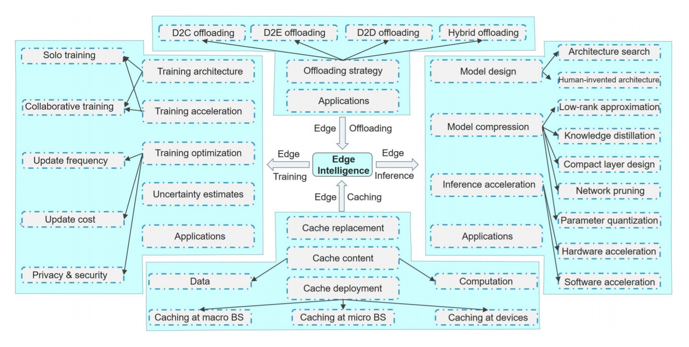
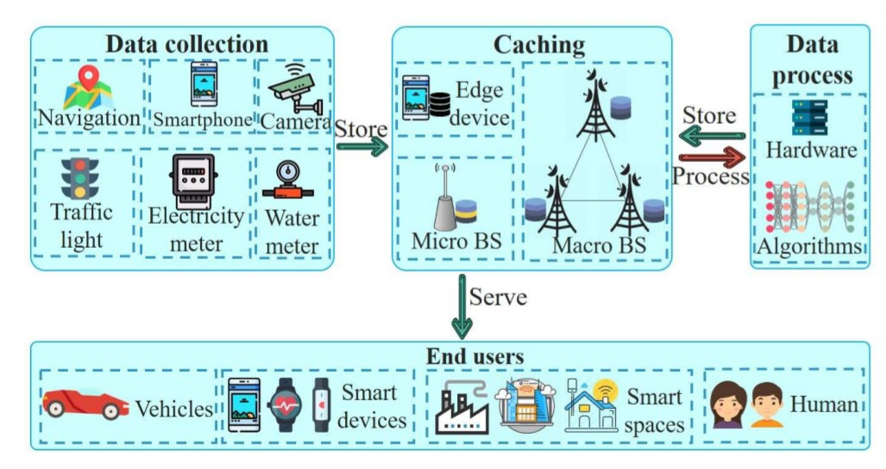
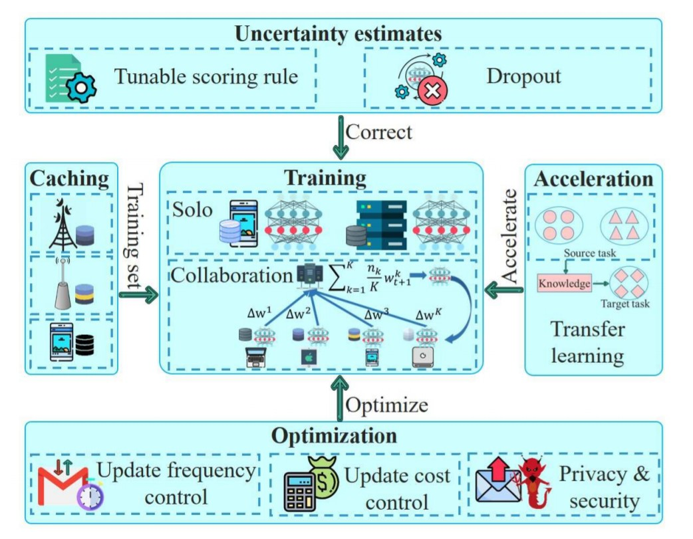
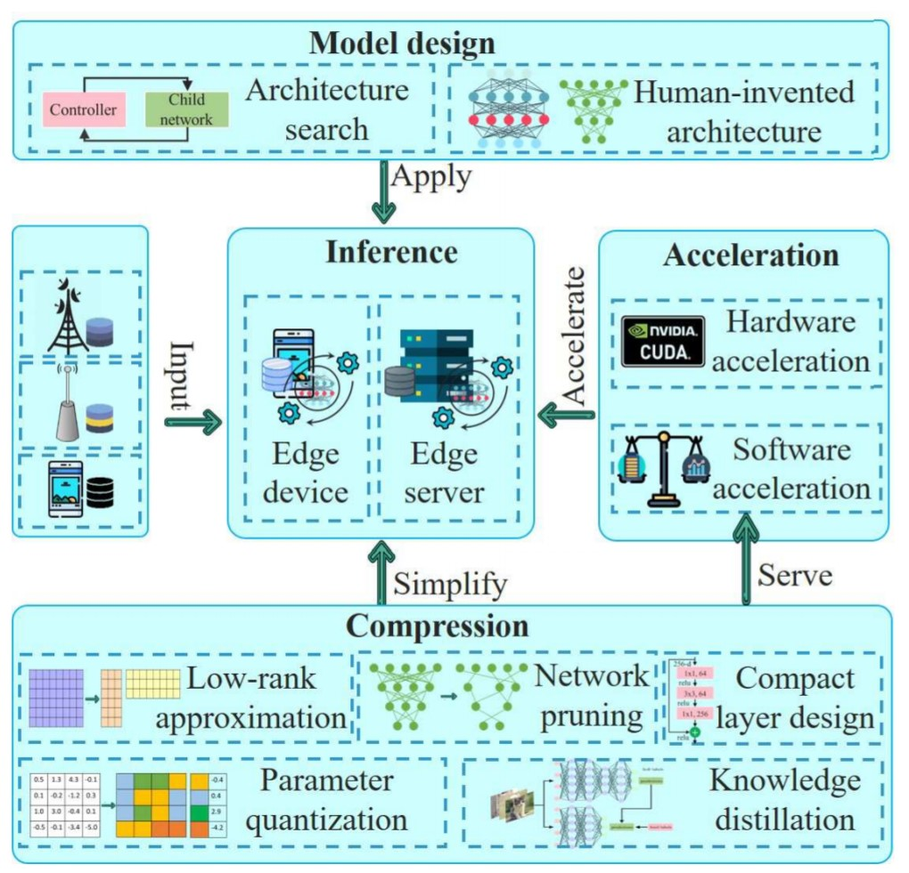
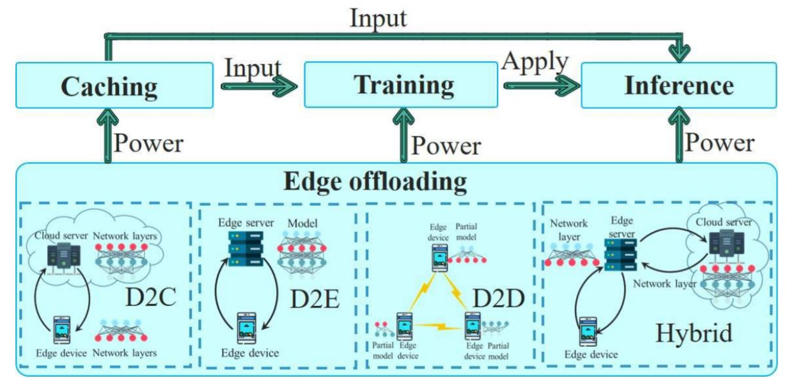

# Edge Intelligence: Architectures, Challenges, and Applications

## Introduction

This paper is a survey about recent research and achievements on edge intellegence (**EI**), they categorize EI into 4 key components: **edge caching**, **edge training**, **edge inference** and **edge offloading**. They present discussion and analysis from multiple views. Finally, they discuss and summarize open issue and challenges.

## Method

1. *Edge Caching*
    - What to cache?
    - Where to cache?
2. *Edge Training*
    - How to train? (Architecture)
    - How to make the training faster? (Acceleration)
    - How to optimize the training procedure? (Optimization)
    - How to estimate the uncertainty of the model output? (Uncertainty estimates)
3. *Edge Inference*
    - How to make models applicable for their deployment on edge devices or servers? (Model design / Compress model)
    - How to accelerate edge inference to provide real-time responses? (Acceleration)
4. *Edge Offloading*
    - How to distribute resource?

## Results

1. *Edge Caching*

- Preliminary of Caching
    - Communication redundancy (Data redundancy)
    - Computation redundancy
- Cache Deployment
    - Macro Base Station (MBS)
        - What files to cache?
        - Most popular content might not be optimal
    - Micro Base Station (SBS)
        - High end-rate
        - Mobility issue
    - At Device
        - Limited storage
        - Incentive to share (D2D)
- Cache Replacement
    - Conventional methods
        - FIFO, LFU, LRU
    - New methods
        - Popularity, Markov Decision Process

2. *Edge Training*

- Training Architecture
    - Solo training
        - Size of neiral network and memory resource are key factor of training efficiency
    - Collaborative training
        - Master-Slave: Federated Learning
        - Peer-to-Peer
- Training Acceleration
    - Transfer learning
    - Exploit shared memory
    - Quantization
    - Interactive Machine Learning (iML)
    - Cross-model transfer training
- Training Optimization
    - Communication frequency
        - FedAVG, EMD, convergence bound of SGD
        - synchronous / asynchronous update
    - Communication cost
        - Deep gradient compression (DGC), AdaComp, MOCHA, Federated dropout
    - Privacy and Security issues
        - Masked update, Homomorphic encryption, Differential privacy
        - Data-poisoning attack
            - FoolsGold, Krum algorithm
        - Model-poisoning attack
            - Model replacement technique (Backdoor)
            - Perform at last round of update
- Uncertainty Estimates
    - Random dropout
        - Computation intensive, not applicable
    - RDeepSense
- Application (Federated Learning)
    - GBoard
    - Medical imaging domain (Sensitive data)
    - Vehicular networks
    - IoT

3. *Edge Inference*

- Model Design
    - Architecture search
        - NASNet, AmoebaNet and Adanet
        - Hardware-consuming
        - Differentiable architecture search (DARTS)
    - Human-invented architecture
        - Depth-wise seperable convolution
        - Point-wise group convolution
        - 1x1 convolutions
    - Applications
        - Face verification
        - Human Activity Recognition (HAR)
        - On-device incremental learning
        - Distracted driving detection
        - Audio sensing
- Model Compression
    - Low-rank Approximation
    - Knowledge Distillation
    - Compact Layer Design
    - Network Pruning
    - Parameter Quantization
- Inference Acceleration
    - Hardware acceleration
        - GPU, CUDA
        - Heterogeneous multi-core architecture (OpenCL)
        - FPGA
    - Software Acceleration
        - Optimising resource management
        - Pipeline design
        - Compilers
        
4. *Edge Offloading*

- Device-to-Cloud (D2C)
    - Data transportation is bottleneck of whole procedure
    - Depends on internet connectivity
    - Privacy and security issue
- Device-to-Edge (D2E)
    - Which component to offload?
    - Which edge server to offload?
    - Mobility issue
- Device-to-Device (D2D)
    - Cluster of devices work together
- Hybrid
- Application
    - Intelligent transportation
    - Smart industry
    - Smart city
    - Healthcare 

## Discussion

1. *Data scarcity at edge*
- Data is sparse and unlabelled
- Possible solutions
    - Adapt shallow model
    - Incremental learning based methods
    - Transfer learning based methods
    - Data augmentation based methods

2. *Data consistency on edge devices*
-  Different sensing environments
-  Sensor heterogeneity
-  Possible solutions
    -  Data augmentation
    -  Representation learning

3. *Bad adaptability of statically trained model*
-  Cannot deal efficiently with the unknown new data and tasks in unfamiliar environments
-  Possible solutions
    -  Lifelong learning machine (LML)
    -  Knowledge sharing

4. *Privacy and security issues*
- End user might have sensitive data
- Possible solutions
    - Credit system
    - Encryption

5. *Incentive mechanism*
- It is not realistic to assume that all users are willing to contribute
- Possible solutions
    - Incentive mechanism
