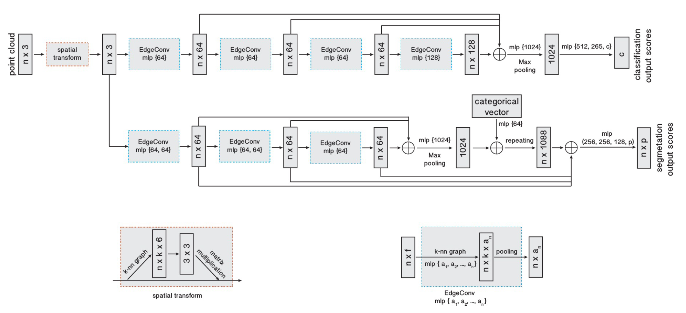
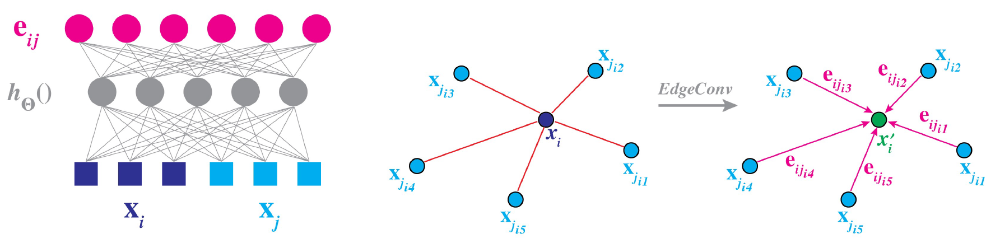
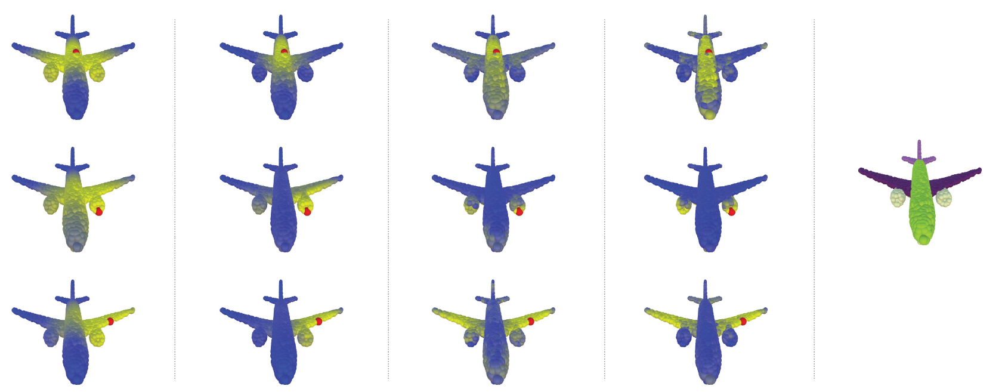
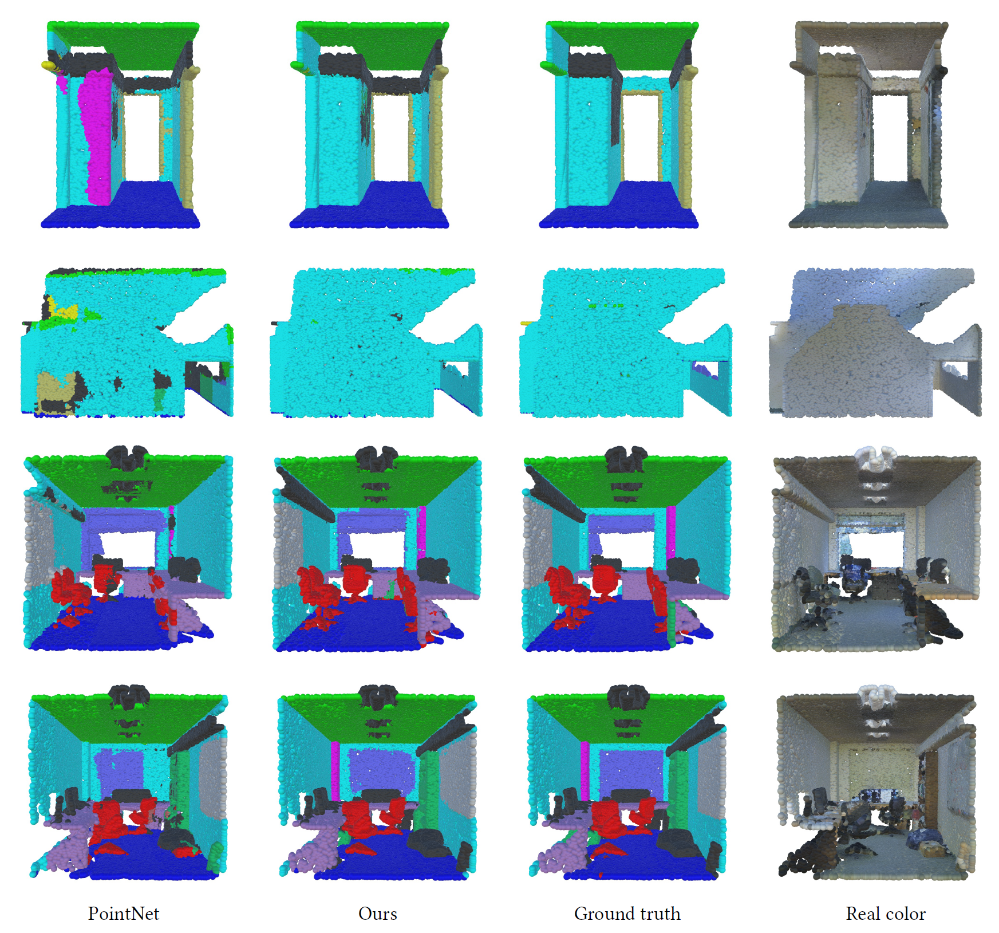

# Dynamic Graph CNN for Learning on Point Clouds

## Introduction:
This paper presents a novel operation &mdash; Edge Convolution,  for learning from point clouds, to better capture local geometric feature while remaining permutation invariance. It could be easily integrated into multiple existing pipeline for point cloud processing, and achieves state-of-the-art performance on benchmark datasets.

## Method:

1. *Edge Convolution*

- 
	- 
	- 
	- Could be implemented as a shared MLP

## Results:

1. *Part Segmentation*

2. *Indoor Scene Segmentation*

## Discussion:

- ["Rethinking Table Recognition using Graph Neural Networks"](https://github.com/Cinnamon/IDEA_Input/blob/master/INFORMATION_EXTRACTION/rethinking_table_recognition_using_graph_neural_networks.md) uses DGCNN in an elagent way, by recognizing a table with rows, columns, and cell structures.
- How to modify the edge convolution to better capture key-value pairing structure ? 
