# Exploiting Interaction Links for Node Classification with Deep Graph Neural Networks

## Introduction:

Node classification is a central task in relational machine learning. Many real world social networks consists of interactions that are changing over time, which can be difficult to leverage the dynamics of temporal interactions in node classification methods. This paper proposes a novel deep neural network architecture for sequences(such as time sequence) of interaction graphs, called TSGNet, that can learn jointly from static and temperal neighborhood structure. 

## Method:

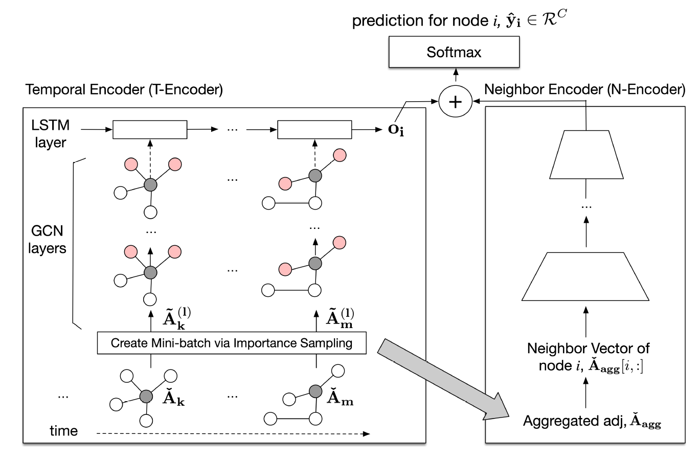

1. *Temporal Encoder (TE)*

- Symmetric normalize by ([Kipf and Welling, 2016](https://arxiv.org/pdf/1609.02907.pdf))
	- 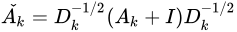
	- 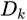 is the diagnal degree matrix of 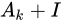
- In each layer *l*, the output generated at time step *k* would be:
	- 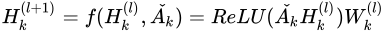
- The final output for each time step will then be an input for an LSTM cell.
- The output of the LSTM will then be passed through a softmax layer.

2. *Neighbor Encoder (NE)*

- 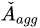 is created by aggregating all elements in 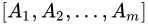
- NE simply stacks fully connected layers for node *i* from its neighbor vector in :
	- 
	- 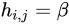, if 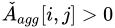, otherwise, 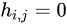
		- Puts more weights on non-zero elements in the matrix
		- set to 20 in their experiment
- Last layer is simply a softmax layer

3. *Addition layer*

- Simply add up (element wise) the output of TE and NE, then pass it through a softmax layer
- Uses categorical cross-entropy as loss function

## Results:

Experiment on 4 real-world network datasets:

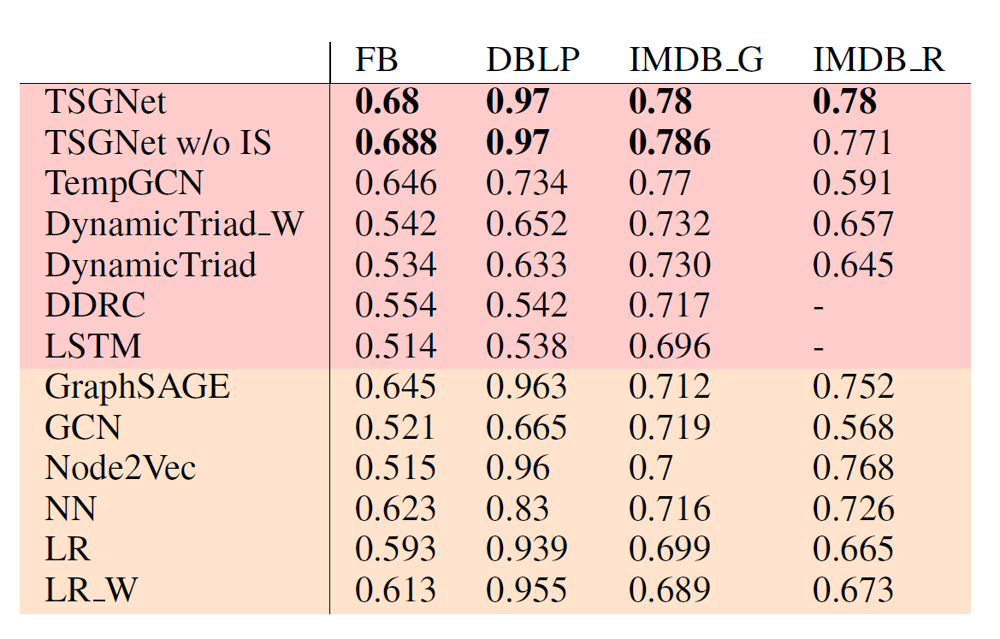

- Facebook: 
	- Predicting political views for active users. 
	- Edge is formed when a user writes on his/her friend's wall.
- DBLB: 
	- Predicting the area where an author publishes the majority of his/her papers. 
	- Edge is formed when two authors publish a paper together.
- IMDB_G (Gross Income):
	- Predicting if a movie has good gross income (over $10M).
	- Edge is formed when 2 movies share an actor/actress.
- IMDB_R (Rating):
	- Predicting if a movie has high rating (over 7.0).
	- Edge is formed when 2 movies share any crew.

## Discussion:

1. Temporal interactions are usefull features in interaction networks.
2. Why pass the last layer of TE and NE to a softmax before adding up, why not simply concat them and then pass through a classifier (such as MLP) ?
