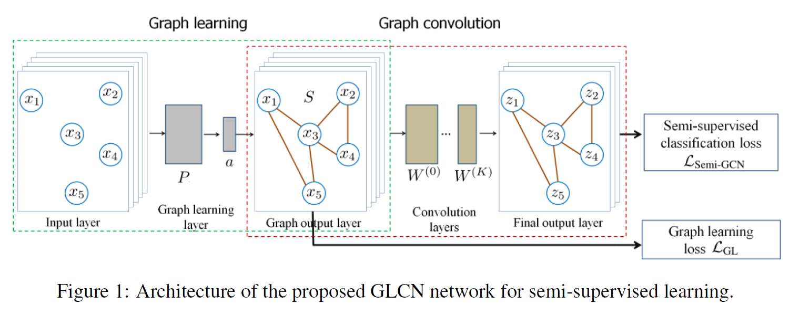

# Graph Learning-Convolutional Networks

## Introduction:

Graph CNNs have been widely used for graph data representation and semi-supervised learning tasks recently. However, existing graph CNN generally use a fixed graph, which might not be optimal. This paper proposes a novel Graph Learning-Convolution Network(GLCN) to learn an optimal graph structure

## Method:

1. *Graph Learning Architecture*

- Seek a nonnegative function that presents the pairwise relationship between 2 nodes
	- Implemented via a single layer neural network
	- $S_{i,j}=g(x_i,x_j)=\frac{A_{i,j}\exp(ReLU(a^T|x_i-x_j|))}{\sum\limits_{j=1}^nA_{i,j}\exp(ReLU(a^T|x_i-x_j|))}$
	- The softmax is to guarantee each row sums up to 1
	- $A_{i,j}$ is the initial adjacent matrix if there is one, else could simply be set to all ones.
- Optimize weight vector *a* by the loss function:
	- $\mathcal{L}_{GL}=\sum_{i,j=1}^n||x_i-x_j||_2^2S_{i,j}+\gamma||S||_F^2$
	- The second term is used to control the sparsity of the learned graph
	- Could also add a term: $\beta||S-A||_F^2$ to incorporate the information of A

2. *GLCN Architecture*

- The graph convolution simply passes node features into MLP  with ReLU as activation and a softmax at the end
- The whole network parameters are trained jointly by minimizing the loss:
	- $\mathcal{L}_{Semi-GLCN}=\mathcal{L}_{Semi-GCN}+\lambda\mathcal{L}_{GL}$
	- $\lambda$ as a tradeoff parameter
	- When $\lambda=0$, the optimal graph is learned based on labeled data(i.e. cross entropy)

## Results:

1.

- GLCN obtains obviously lower cross-entropy value
	- Higher predictive accuracy !
- Convergence speed is only slightly slower

2.

- 2D t-SNE visualization of the feature map output by the first convolution layer of GCN and GLCN
- One can note that the class distribution is more clear with GLCN

3.

- Experiment on 3 standard citation network benchmark datasetsand 4 image datasets
- GLCN outperforms traditional fixed-graph CNNs on various semi-supervised learning tasks

## Discussion:

1. GLCN is not limited to semi-supervised learning tasks
2. Might be benefitial to our key-value relation prediction problem
