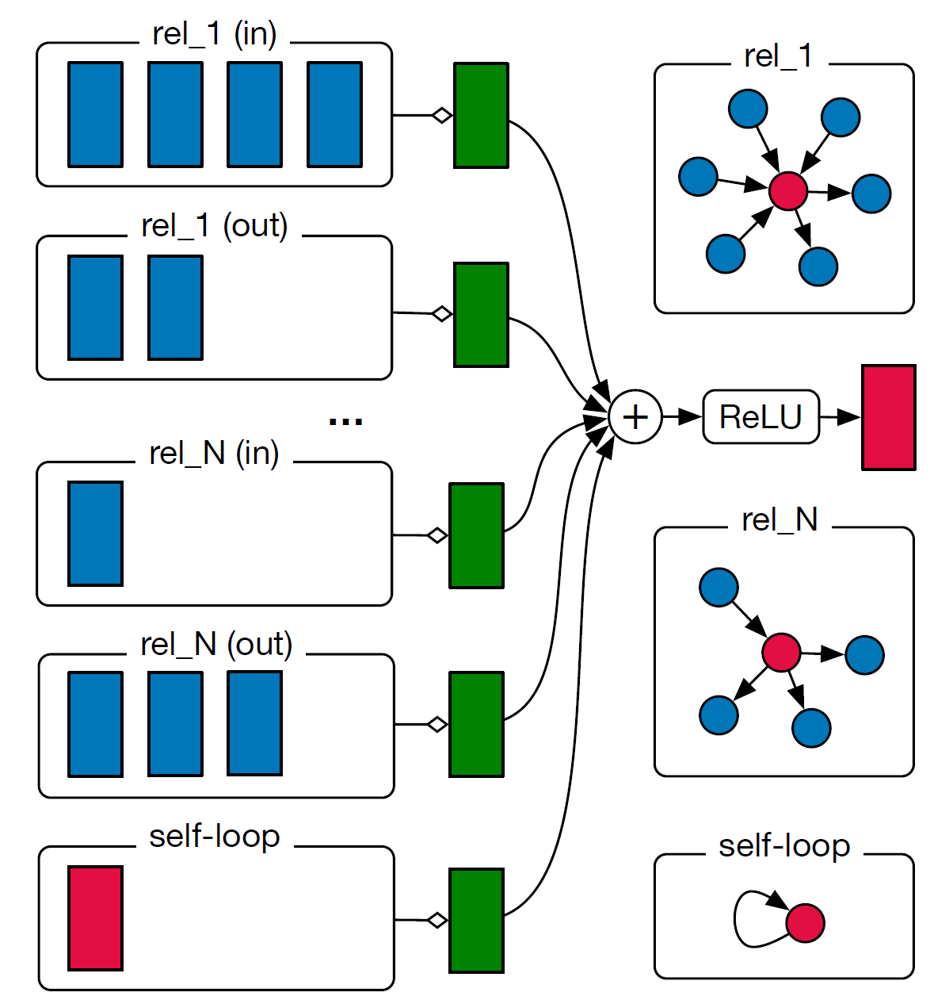
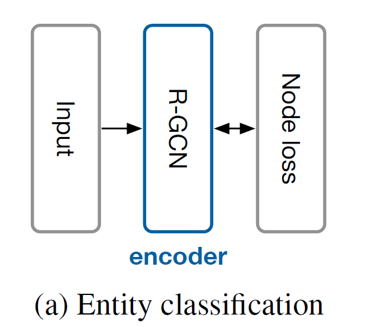
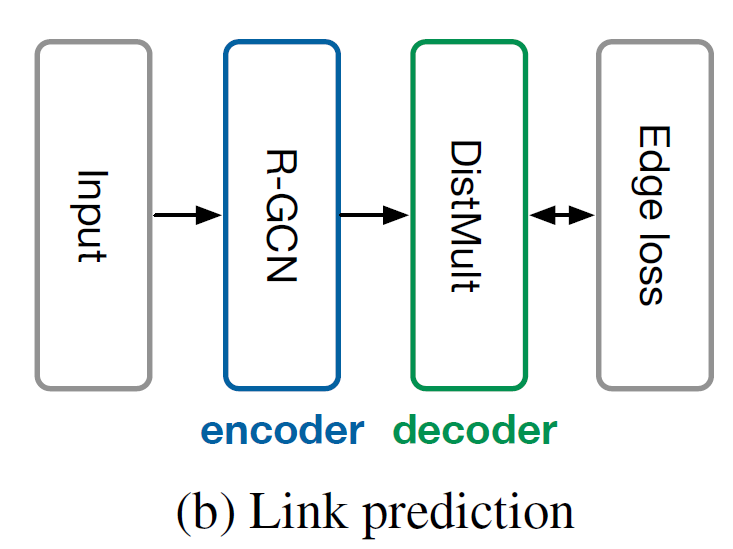
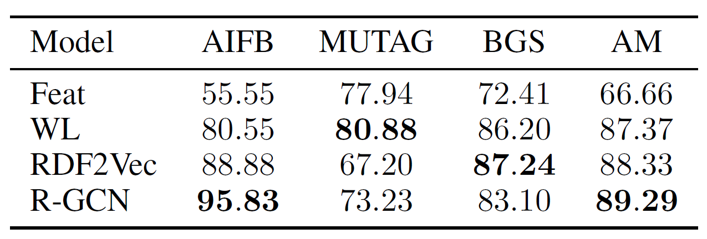
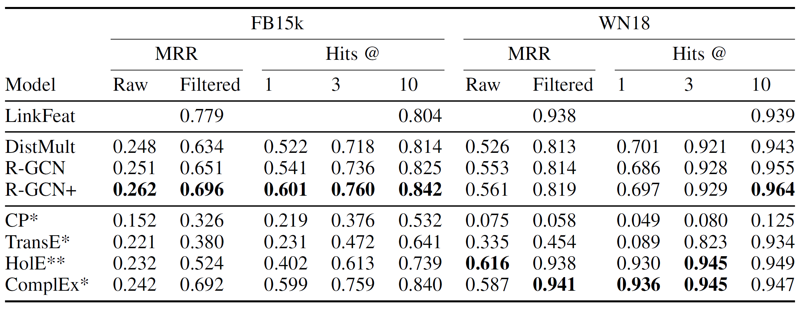

# Modeling Relational Data with Graph Convolutional Networks

## Introduction:
Knowledge graphs enable a wide variety of applications, including QA(question answering) and IR(information retrieval). However, even the largest(e.g., Yago, DBPedia or Wikidata) remain incomplete, predicting missing information in knowledge bases is the main focus of statistical relational learning (SRL). This paper introduces R-GCN(Relational Graph Convolution Network) for entity classification and an autoencoder structure model for link prediction.

## Method:

1. *R-GCN*

   

- $h_i^{(l+1)}=\sigma(\sum\limits_{r\in\mathcal{R}}\sum\limits_{j∈N_i^r}\dfrac{1}{c_{i,r}}W_r^{(l)}h_j^{(l)}+W_0^{(l)}h_i^{(l)} )$
- $c_{i,r}$ is a problem-specific normalization constant, can be learned or chosen in advance

2. *Regularization*
- Basis-decomposition
    - Linear combination of basis transformation
    - $W_r^{(l)}=\sum\limits_{b=1}^{B}a_{rb}^{(l)}V_b^{(l)}$
- Block-diagonal-decomposition
    - Direct sum over a set of low-dimensional matrices
    - $W_r^{(l)}=\bigoplus\limits_{b=1}^{B}Q_{br}^{(l)}$
    
3. *Entity Classification*

   

- Simply stack **R-GCN** layers with softmax at the end
- Cross entropy loss:
    - $\mathcal{L}=-\sum\limits_{i\in\mathcal{Y}}\sum\limits_{k=1}^{K}t_{ik}\ln h_ik^{(L)}$

4. *Link Prediction*

   

- Encoder maps each node to a embedding vector
- Decoder constructs edges of graph relying on the node embedding, in other words, scores the edges through some function 
    - Uses **DistMult** factorization ([Yang et al. 2014](https://arxiv.org/pdf/1412.6575.pdf)) in their experiment
    - Negative sampling (only update $w$ negative words)
    - Cross entropyt Loss:
        - $\mathcal{L}=-\dfrac{1}{(1+w)|\hat\varepsilon|}\sum \limits_{(s,r,o,i) \in \mathcal{T}} y \log l(f(s,r,o)) + (1-y) \log (1-l(f(s,r,o)))$

## Results:

1. *Entity Classification*

   

- Achieves state-of-the-atr result on **AIFB** and **AM**
- Label entities in **MUTAG** and **BGS** are only connected via high-degree hub nodes that encode a certain feature, thus, fixed choice of normalization constant is partly to blame.
    - Attention !

2. *Link Prediction*

   

- R-GCN+ denotes ensemble of R-GCN and DistMult
- ComplEx outperforms at WN18, maybe consider using it as the decoder in the future

## Discussion:

- Adding a encoder in front of link scoring function improves the link prediction, since the node embedding implies edge features 
- Autoencoder style structure works well in these kind of problems
- R-GCN is used for recovering edges, which doesn't quite fit our problem
