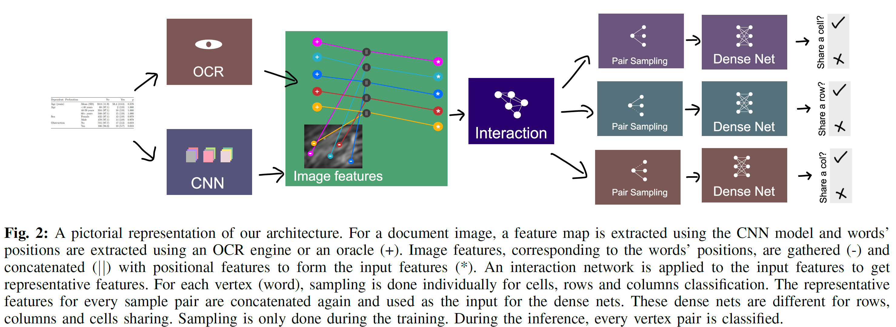
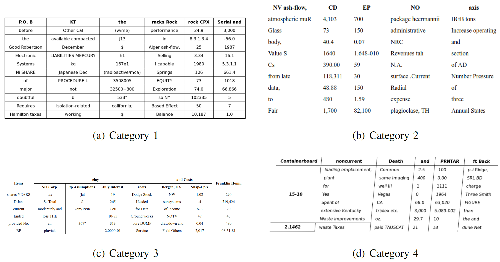
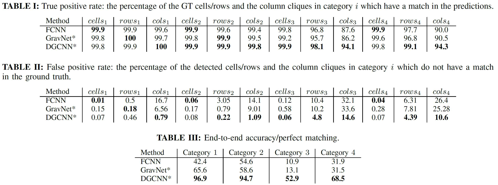

# Rethinking Table Recognition Using Graph Neural Networks

## Introduction:
This paper redifined the structural analysis problem (in this case, table structures) using graph models, and designs a novel differentialble architecture which reaps the benefit from both convolutional neural networks (image feature extraction) and graph neural networks (efficient interaction between the vertices).

## Method:

   

1. *Convolutional Neural Network*
- OCR engine extracts word positional features.
- CNN extracts the whole image feature.
	- Only used a shallow CNN in the experiment to keep parameter count low, however, any standard architecture can be used.
- A gather operation is performed to collect feature for each word corresponding to its spatial position.
- Concatenate positional feature and gathered image feature as input for next stage.
2. *Interaction Network*
- Tested on 3 different model (limited total parameter count to 1M for fair comparison):
	- Baseline dense net (dubbed FCNN for Fully Connected Neural Network).
	- Modified version of [DGCNN](https://arxiv.org/pdf/1801.07829.pdf).
	- Modified version of [GravNet](https://arxiv.org/pdf/1902.07987.pdf).
- Output representative features of each vertex.
3. *Runtime pair sampling*
- Classifying every word pair is memory intensive with complexity O(${N^2}), and then scale linearly with the batch size:
	- Employ Monte Carlo based sampling.
- Uniform sampling is highly biased towards not adjacent vertex pairs: 
	- Sample equal number of adjacent and not adjacent vertex pair on average (for each problem).
- For inference, we don't need to sample since we don't need to use the mini-batch approach.
4. *Classification*
- Output 3 sets logits
	- Backpropogate through the function.
	- Predict classes and form resultant adjacency matricies.

## Results:

   

   

1. DGCNN perfoms the best out of the 3 models.
2. Individual table element is misleading due to large class imbalence problem.

## Discussion:
- Only positional features for vertecies is used in the paper, NLP features (e.g. GloVe) could also be used in real-world dataset.
- How to apply the method to other problems, such as document segmentation or our key-value pair problem.
- Can we use loss function such as focal loss or class-balanced cross entropy to confront the imbalance class problem?
