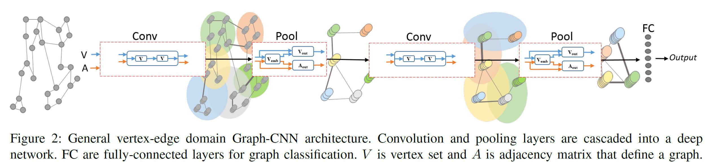
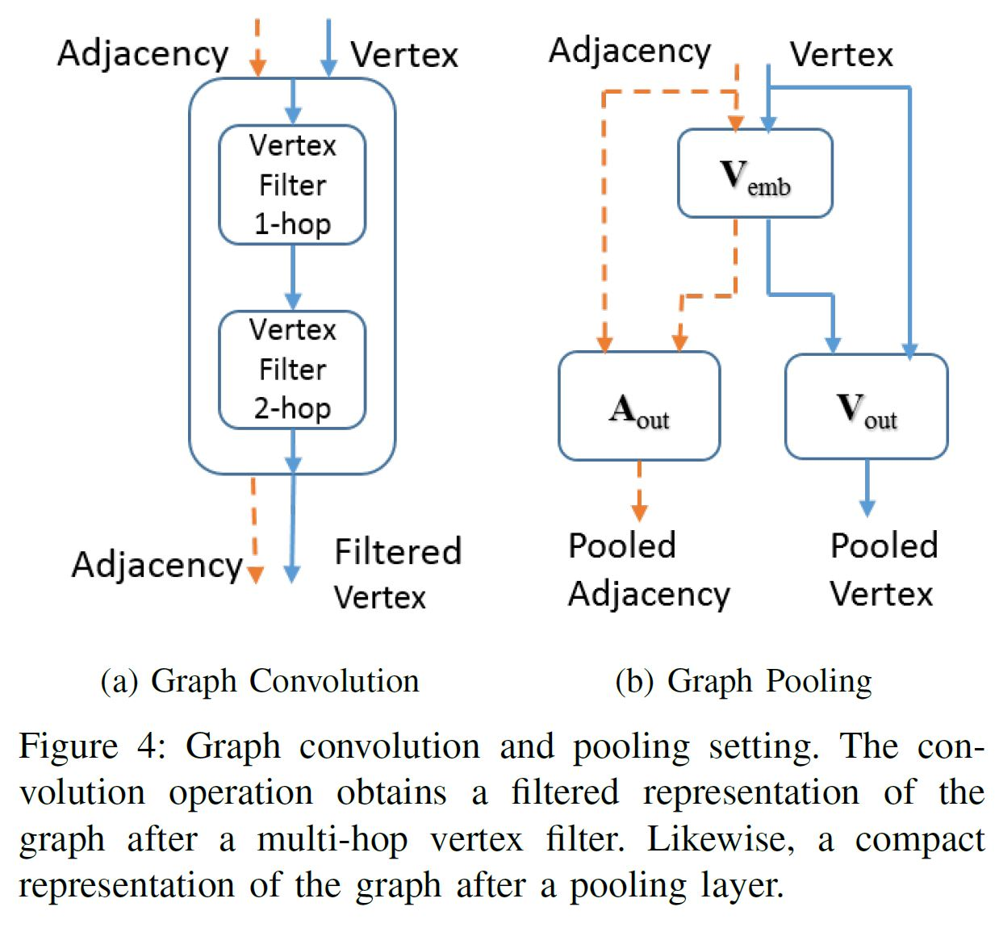
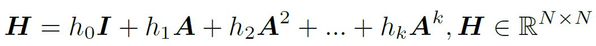
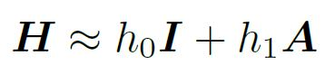
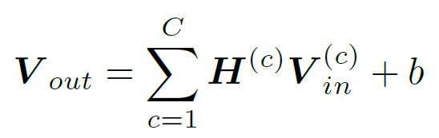
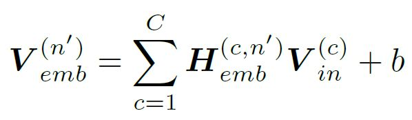
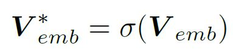
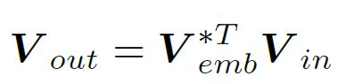
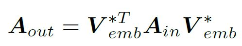

# Robust Spatial Filtering with Graph Convolutional

## Introduction:
This work is a step towards creating a one-to-one mapping between deep convolutional neural networks for signals and
images and one for graphs. Further, the presented methods can be applied to graphs that are homogeneous or heterogeneous in nature.

## Method:

   

   

1. *Graph Convolution*
- Spatial domain convolution for graphs:
	- 
- Intuition from VGGNet, cascade over multiple layer:
	- 
- Multi-channel filtered down to single channel:
	- 
2. *Graph Embed Pooling*
- First create an embedding matrix, then transform the adjacency and vertex to the embedded dimension:
	- 
	- 
	- 
	- 
- Advantages:
	- Flexible to take input of any cardinality and produce a fixed size output.
	- The pooling is learned, so the output is a reduced-dimension input in at least locally optimal.
	- Could set the output dimension to 1 to produce a graph presentation or Graph Fully-Connected (GFN) vector. (analog to globol pooling in traditional CNN)

## Results:
1. Compare Graph-CNN to traditional CNNs using CIFAR-10 and ImageNet image classification datasets:
	- Learning curves from both datasets indicate high agreement between Graph-CNN and traditional CNNs.
	- Shows that traditional CNNs can be modeled as Graph-CNN.
2. Perform gender classification basedon Human Connectome Project(HCP) fMRI data:
	- Different intrinsic connectivity as measured with rs-fMRI exist between subjects.
	- Graph-CNN filters are capable of detecting and utilizing these differences for calssification.
	- Can be used for distinguishing disease states from healthy brains on the basis of measurable differences in spontaneous activity.
3. Classify chemical compounds with the NCI1 and D&D datasets:
	- The Graph-CNN architectures achieve state-ofthe-art performance compared with other recent approaches.
4. Classify facial expressions based on the Bosphorus 3D face dataset:
	- Traditional CNN with image data beats Graph-CNN, but its data has richer features.
	- Shown that Graph-CNNs are capable of processing 3D mesh data, and have plenty of room for iteration to become competitive.
5. Evaluate document classification with the Cora document datasets:
	- Demonstrate the use of Graph-CNN architecture to model a vertex classification task.

## Discussion:
- Traditional CNNs are a subset of Graph-CNN for image data.
- The mechanics of these Graph-CNNs should be analyzed through filter visualization and more in-depth study of the distributions of graph data across the network.
- The theory should be expanded to enable filtering of edges as well as vertices.
