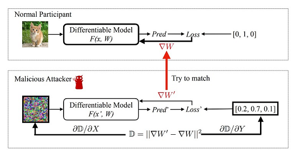
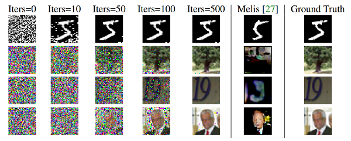
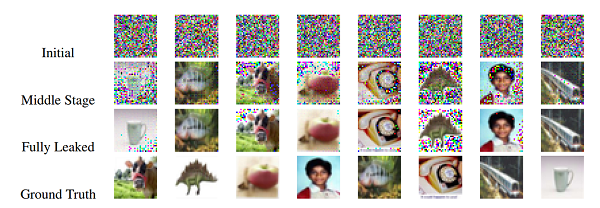

# Deep Leakage from Gradients

## Introduction

In distributed machine learning, exchanging only grdients instead of data is widely used to preserve user data privacy(e.g. federated learning). For a long time, people believe that gradients are safe to share, and data will not be leaked. However, this work shows that it is still possible to obtain the private data with the publicly shared gradients (namely *Deep Leakage*). They've also shown a few defense strategy to prevent such deep leakage.

## Method

1. *Attack*

   

The methodology is quite simple, we initiate with an dummy input and dummy target, and obtain the dummy gradients. Minimize the difference between the dummy gradients and ground truth gradients w.r.t. input and target. After convergence, the input and target will be revealed.

Note that this method only works when the model $F$ is two times differentiable (They replaced ReLU with Sigmoid and removed strides in neural networks to satisfy this property).

2. *Defence*

- *Noisy Gradients*
    - Add noises to the gradients (**Differntial Privacy**)
    - When sufficient noise is added, the attack fails, however, the performance of the model might be affected
    - Half precision formats fail to defend.
- *Gradient Compression and Sparsification*
    - Prune out small gradients, results show that when sparsity is high, pruning could defend well.
- *Others: Large Batch, High Resolution, Cryptology*
    - Both large batch and high resolution increases the computaion of the attacker, making it hard for him to attack
    - Cryptology is the perfect method to defense, however, might trade off between security and speed/efficiency or feasibility.

## Results

   

The results show high quality recover images. It also works on NLP tasks, please check out the results on their paper.

   

Batched data is also possible to recover (order might be different). However, it takes more time to converge in batched data.

## Discussion

1. A lot of neural networks nowaday adopt ReLU or other strategies to improve performance, which might not be two times differentiable, this might be a big challenge for the attackers to leak data.
2. I didn't fully understand the leakage on batched data, might need to try reproducing the results myself to fully understand the mechanics behind it.
3. This work doesn't show the success rate of their method, which is questionable.
