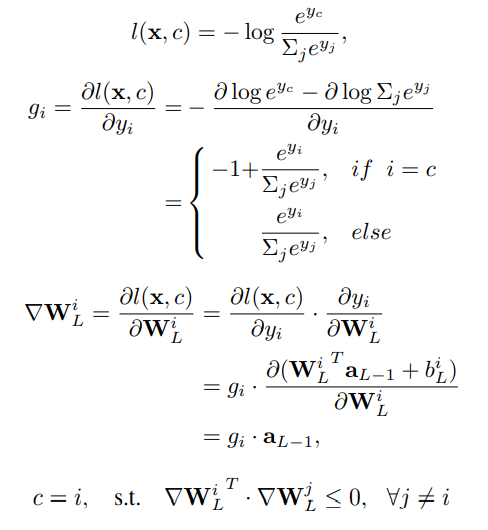
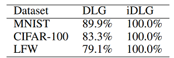

# iDLG: Improved Deep Leakage from Gradients

## Introduction

In DLG ([Deep Leakage from Gradients](https://papers.nips.cc/paper/2019/file/60a6c4002cc7b29142def8871531281a-Paper.pdf)), both the data and the target is obtained from optimizing the gradient loss. This work discovered that when using softmax and cross-entropy, the target could be extracted definitely.

## Method

When using softmax and cross-entropy loss, the gradient is negative only on the target label. The derivation process is as the following:

   

## Results

   

The extracted labels are 100%, while DLG might extract incorrect labels.

## Discussion

1. iDLG converges faster and better since it has the correct target label in hand.
2. This work only works on top of a very restricted assumption, which only works on cross-entropy loss and you have to obtain the gradient for each sample in a training batch, this might not be realistic.