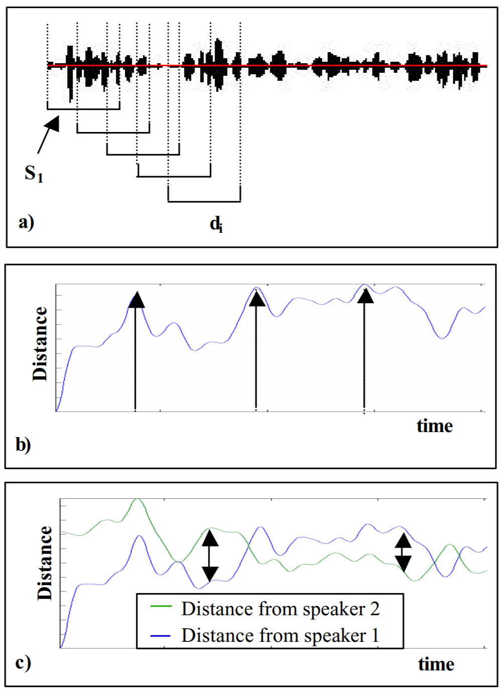
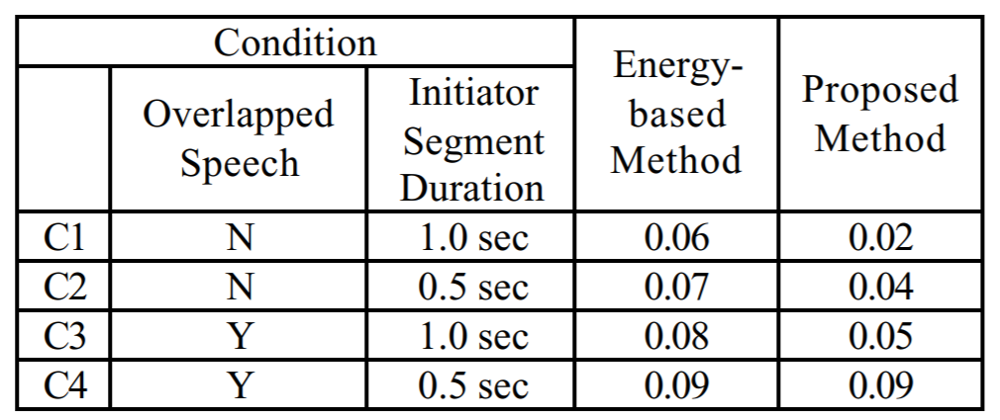
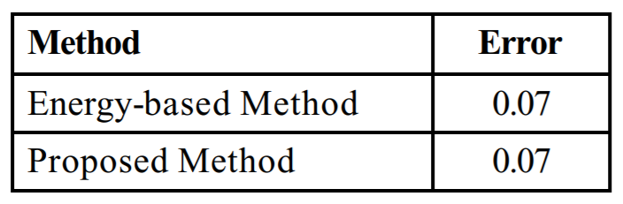

# A New Speaker Change Detection Method for Two-Speaker Segmentation

## Introduction

In speaker change detection, we will not have prior information about the speakers, thus we need obtain estimates for training speaker models with a small segment at the beginning of an conversation. This paper presents a new method for obtaining the estimates.

## Method

1. *Speaker 1 Data Selection (a)*
- Begin of conversation is assumed to represent speaker 1
- Assume speaker 1 speaks at least 1 second

2. *Distance Computation (a)*
- Sequence of Generalized Likelihood Ratio (GLR) is computed between selected segment for speaker 1 ($S_1$) and shifted segments ($d_i$)
- The distance sequence is mean and variance normalized and smoothed using a sliding window

3. *Speaker 2 Data Selection (b)*
- The segment whose distance is the largest and is not silence is assumed to represent speaker 2
- Arrows in (b) point out candidate regions

4. *Distance Computation*
- Using the selected region for speaker 2, a new sequence of distance is computed (green line in \(c\))

5. *Segment Assignment*
- Segment boundaries are defined at the points where distance to each speaker is equal
- Each segment is assigned to the speaker with smaller distance

6. *Segmentation Refinement*
- After segment assignment, we have a better estimate of speakers, thus we can now choose more segments where the difference between distances of two speakers are the highest (double arrow in \(c\))
- Step 1 to 5 can then be repeated

## Results

1. *Development Database (generated from HTIMIT database)*

2. *NIST Database*

## Discussion

1. Too many assumptions are made, but has potential
2. Extend the method to N-speaker ?
3. This is not real-time speaker segmentation
