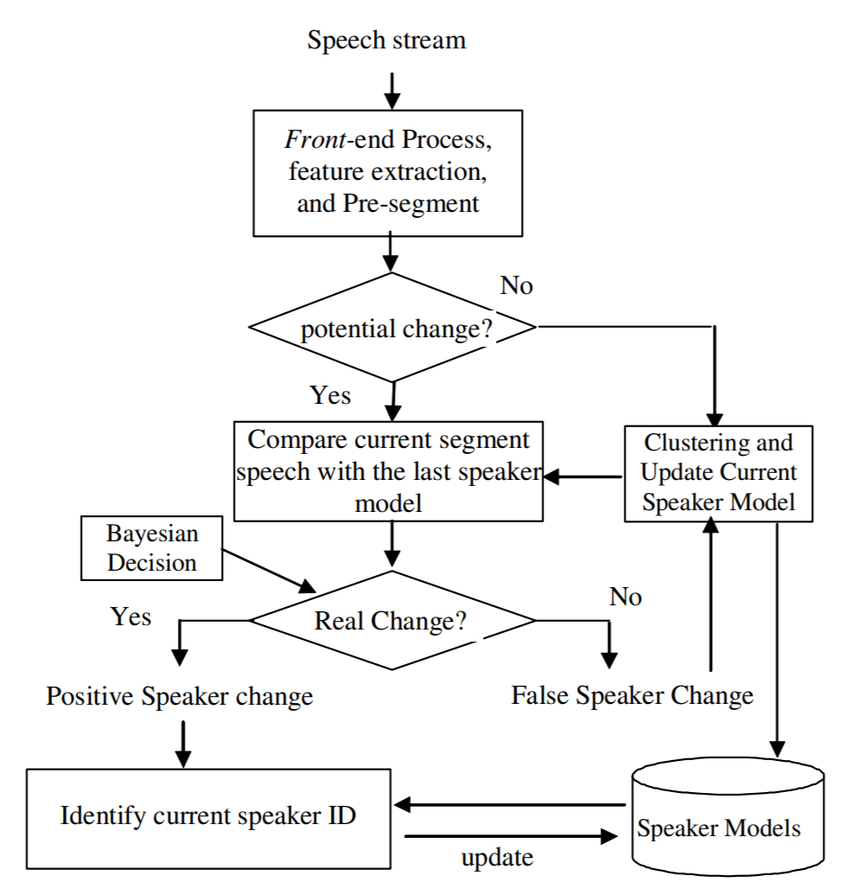
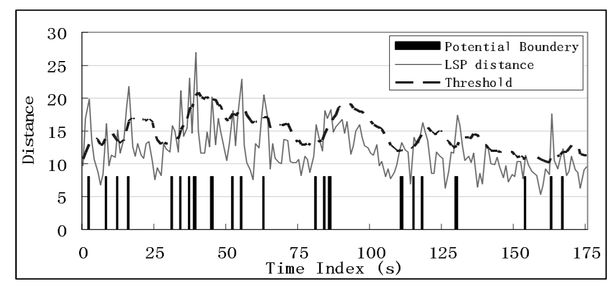
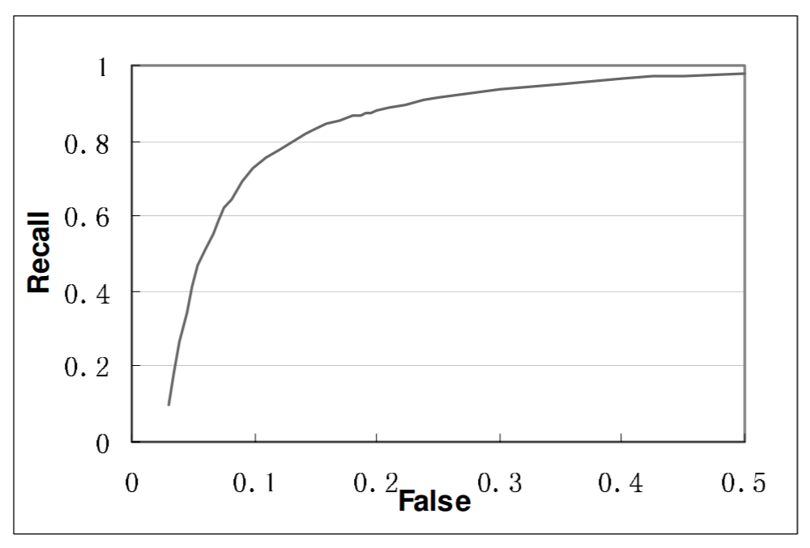
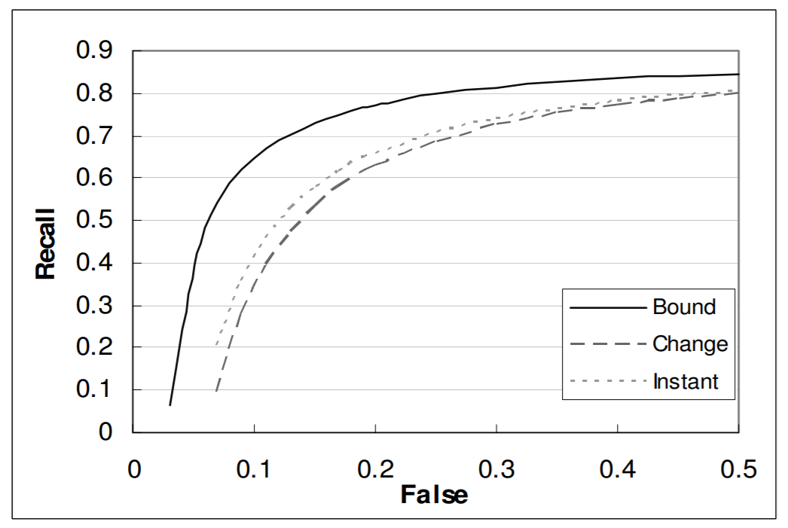

# Speaker Change Detection and Tracking in Real-Time News Broadcasting Analysis

## Introduction

This paper addresses the problem of real time speaker change detection and speaker tracking in broadcasted news video analysis. In such a case, both speaker identities and number of speakers are assumed unknown.

## Method

1. *Feature Selection and Distance Measure*
- Use LSP, MFCC and pitch features and Bayesian Fuse them to get more reliable result
- Distance is determined by covariance and mean, since mean is high biased due to environment, ignore parts that contain mean

2. *Speaker Change Detection*
- Front-End Processing
	- Down-sample to 8KHZ, 16bits, mono channel
	- Divide to 3-second window with 2.5-second overlapping sub-segments
	- Divide sub-segments into non-overlapping 25ms-long frames
- Detect Potential Speaker Change Point
	- Find peaks in distances
	- Use an adaptive threshold to filter the peaks found
- Incremental Speaker Model Updating
	- Start with GMM-1
	- Grdually update until GMM-32
- Speaker Change Boundary Refinement
	- Bayesian fusion model

3. *Speaker Tracking*
- Hypothesis test
- Identify immediately after speaker change point detected (Instant)
- Identify after the next speaker change point is detected (Change)
- Identify after the next speaker change point is confirmed (Bound)

## Results

1. *Speaker Segmentation*
- Example

- Result

2. *Speaker Tracking*

## Discussion

1. Could change the sub-segment length shorter for more accurate resule (but more computation)
2. Adaptive threshold is a good idea to use
