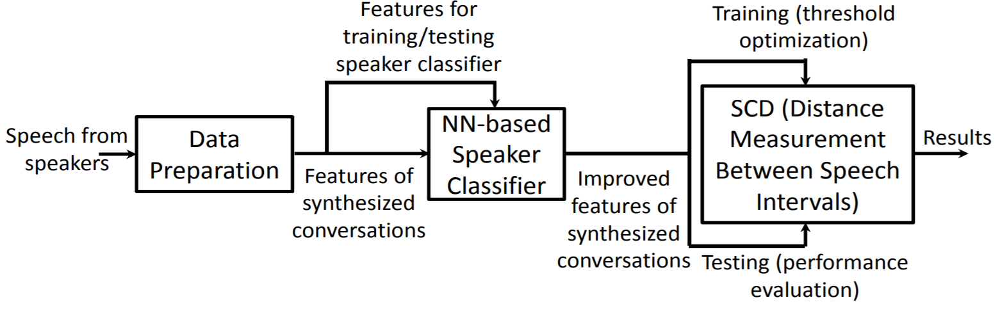
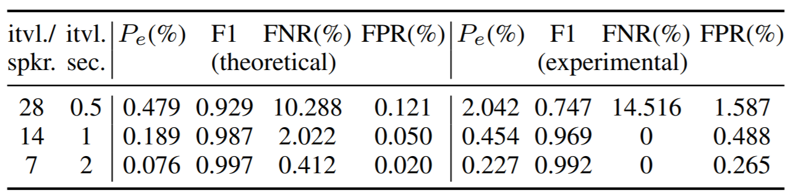

# Speaker Change Detection Using Features through A Neural Network Speaker Classifier

## Introduction

In this work, a noval real-time SCD approach using improved features through a speaker classification network is presented.

## Method

1. *Data Preperation*
- Scaling the maximum of absolute amplitude to 1
- Voice Activity Detection (VAD) to eliminate the unvoiced part of speech

2. *Feature Extraction, Normalization and Concatenation*
- Extract 39-dimensional MFCC
- Normalize with own mean and variance
- Concatenate 10 frames with hop size 3

3. *Neural Network Speaker Classification*
- The concatenated 390-dimensional MFCC is used as input
- Structure: 390-200-200, sigmoid as activation
- Use binary crossentropy with L2 reguralizer as loss

4. *Distance metric*
- Use p-norm, p=2 provides the best results

5. *SCD Training and Testing*
- 200 in-domain speakers for NN training
- 63 out-domain speaker for threshold optimization
- 63 out-domain speaker for performance evaluation

## Results

## Discussion

1. Using neural network for feature extraxtion
2. The 100% performance on test data is weird
3. Should test more on real-world data
4. Why use the output of the neural network, using the hidden layer as embedding seems more intuitive
