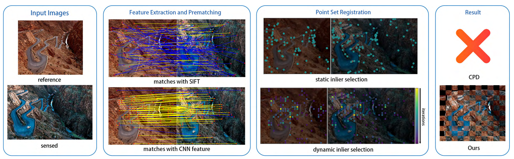
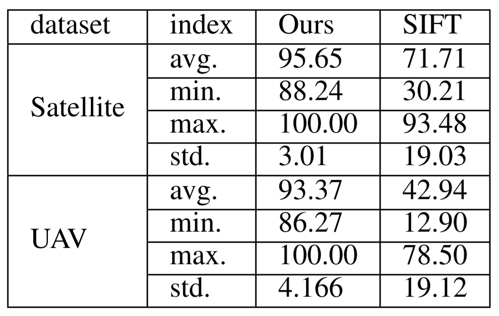
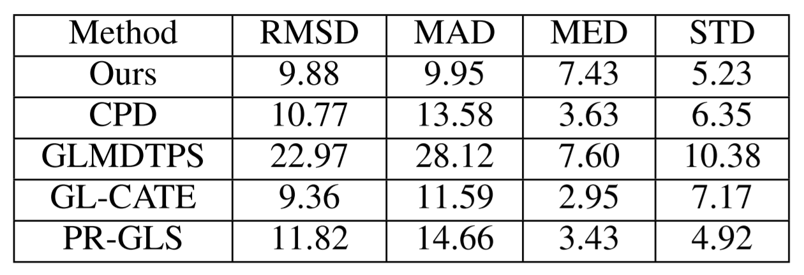
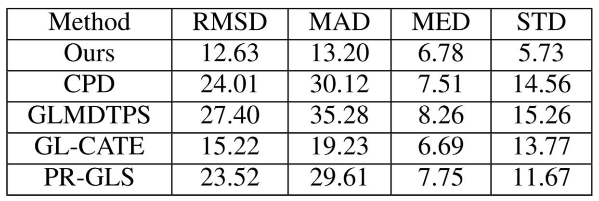

# Multi-Temporal Remote Sensing Image Registration Using Deep Convolution Features

## Introduction

Image registration is the process of finding the optimal alignment between images. Inspired by SIFT, this paper proposes a novel non-rigid image registration method that outperforms SIFT.

## Method

1. **Generating Feature Descriptors**
- Use *VGG16* as backbone and take 3 pooling layer's output to build feature
	- pool_3: $28\times28\times256$
	- pool_4: $14\times14\times512$
	- pool_5_1: $7\times7\times512$, obtained by a max-pooling after block5conv1
- Obtain Feature $F_1$, $F_2$, $F_3$
	- $F_1$: Directly us pool_3
	- $F_2$: Resize pool_4 with Kronecker product $I_{2\times2\times1}$
	- $F_3$: Resize pool_5 with Kronecker product $I_{4\times4\times1}$
- Normalize: $D_i(x) = \dfrac{F_i(x)}{\sigma(F_i(x))}, i=1,2,3$

2. **Feature Prematching**
- Distance between 2 feature points are weighted sum of 3 distant values
	- $d(x,y)=\sqrt2d_1(x,y)+d_2(x,y)+d_3(x,y)$
	- $d_i(x,y) = Euclidean-distance(D_i(x), D_i(y))$
- Feature point x is matched to y if:
	- $d(x,y)$ is the smallest of all $d(\cdot, y)$
	- All other $d(x,y)$ are greater than a threshold $\theta$

3. **Dynamic Inlier Selection**
- Select Inliers for transformation iteratively
	- Starting with a high threshold to select confident pairs and slowly lowers the threshold over time
	- Points selected as inliers guide the movement of point locations whereas outliers are moved coherently
	- Use EM theory to optimize a cost and stop when converge

## Results

- Two types of datasets are used
	- a multi-temporal satellite image dataset acquired from Google Earth
	- a multi-temporal UAV image dataset captured using a small UAV (DJI Phantom 4 Pro) with a CMOS camera

1. **Feature Prematching Precision Test**

2. **Image Regisration Accuracy Test**

- Satellite:

- UAV:

## Discussion

1. Deep methods outpeforms traditional methods, this is a trend over the few years, using DNN based methods to achieve traitional methods
2. VGG is used as the feature extraction backbone in this paper, maybe we could try other models such as ResNet or Inception as backbone
3. Only 3 different sized features were used for descriptors, maybe we could try with more features(beware of computation)
4. Every 8x8 will only have one description, which is more even than SIFT, but also performs better than SIFT. This might be good for our application, since the number of matched points would be a better measurement if total number of descriptors is fixed
5. Threshold for prematching is determined by the quality of all descriptors, thus will alway get around the same number of matched points, maybe could use a fixed threshold or other methods to represent similarity
6. The dynamic inlier selection is only for transformation(similar to homography with SIFT), might not need it for our application(also speeds up time, since this is the most time-consuming part)
