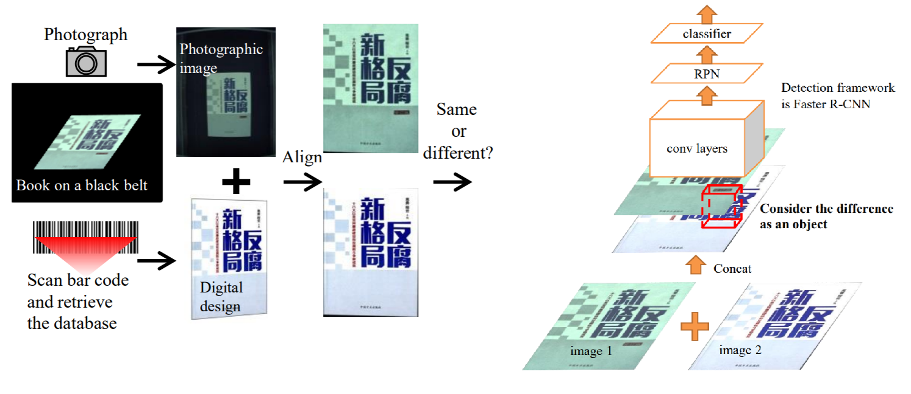
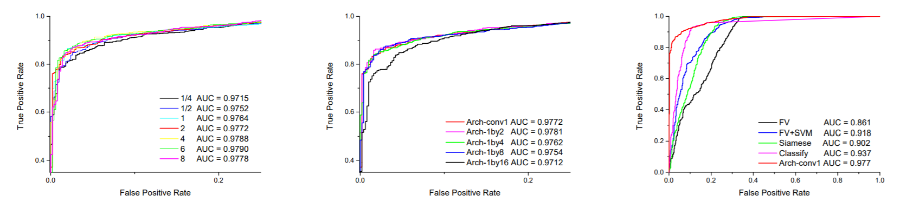

# Spot the Difference by Object Detection

## Introduction:

This paper proposes a simple but effective method to "spot the difference" of 2 images, by using only weakly labeled data. They also attempted to compress the model, accelerating without losing too much accuracy.

## Method:

- Generate synthetic data
	- Local (partial) different
	- Global (whole image) different
- Use SIFT and RANSAC to align 2 images
- Concat 2 RGB images into a 6 channel image and treat them as objects to find with object detection methods
- Simplify model by reducing channel of the last few layers, acheives 24 times acceleration

## Results:

1. More synthetic data seems to be better, but the growth decreases after synthetic is over 100% of the origin data
2. Simplified models seems to perform as well as the origin Arcg-conv1 (until $\dfrac{1}{16}$)
3. Comparison with other methods

## Discussion:

1. Really innovative to make this problem into a object detection problem
2. More and more object detection methods are emerging now, could improve with those new methods
3. In our case, aligning images might be quite difficult, thus this method might not be good enough (?)