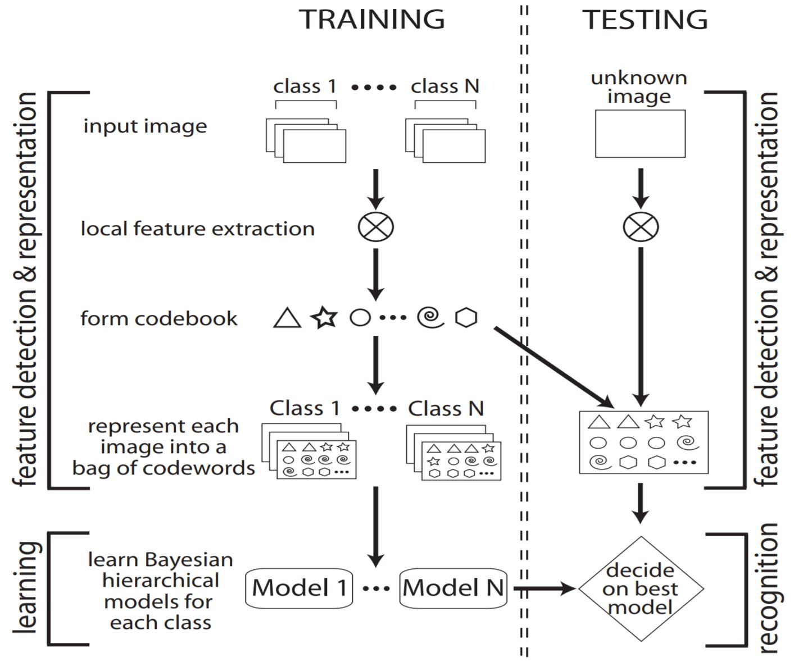
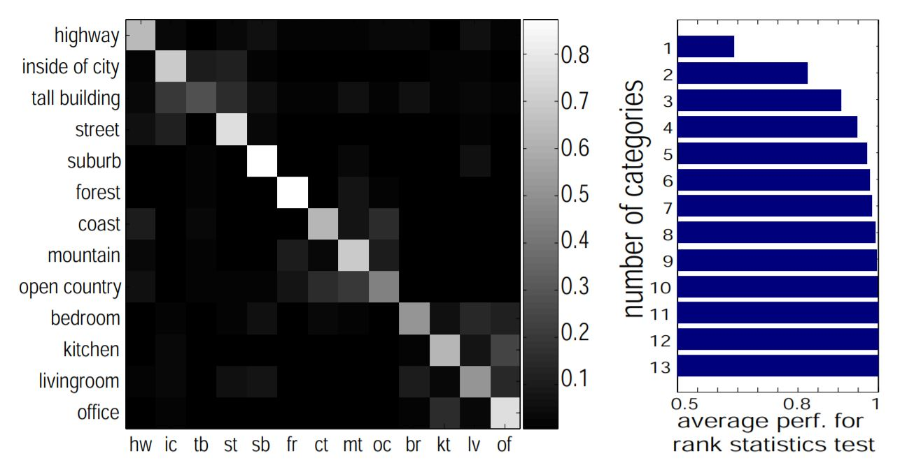
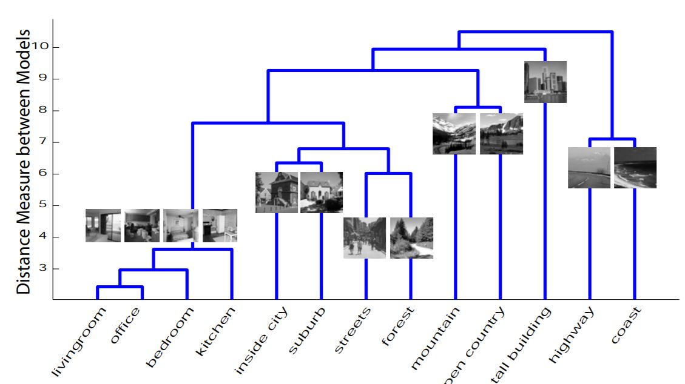

# A Bayesian Hierarchical Model for Learning Natural Scene Categories

## Introduction

The ability to analyze and classify accurately and rapidly the scene in which we find ourselves is highly useful in everyday life. Previous methods often rely on manual annotation of intermediate properties. This work's innovation is to directly learn the intermediate properties from images automatically without human labeling.

## Method

1. *Local Feature Extraction*
- 4 ways of ectracting local region
	- Evenly sampled grids
	- Random sampling
	- Kadir & Brady saliency detector
	- Lowe’s DoG detector
- 2 types of representation
	- Normalized gray value
	- 128-dim SIFT vector

2. *Codeword Formation*
- Use K-means to cluster local features and remove clusters with small members

3. *Image Representation*
- Each patch of the image is represented as a codeword
- The image is represented by a bag of codewords

4. *Bayesian Model Learning*
- Maximize log likelihood term
- Use EM algorithm to solve optimization problem

## Results

1. *Performance*

- Confuse most at the 4 indoor scenes
- Evenly sampled grid + SIFT produces the best result

2. *Scene Hierarchy*

- Establish relations between scenes by looking at the model distances between them
- We could then group scenes of images into a sensible hierarchy, which is similar to what humans would do 
- The 4 indoor scenes have close relations, indicates the confusion among them

## Discussion

1. The intermidiate feature is somewhat like an one hidden layer convolution neural network, extracting useful features automatically by only giving the final category label. We could also see that the intermediate features extracted are mostly simple orientations and illumination patterns, which is also similar to low level features extracted from low layers od CNNs.
2. The method of this paper is inspired by natural language processing method, we could see a lot of analogy in the paper, such transfering knowledge from different domains are common and very useful
3. They use histogram model in their experiments which are commonly used and easy to explain, the framework of their method could easily generalized and extended