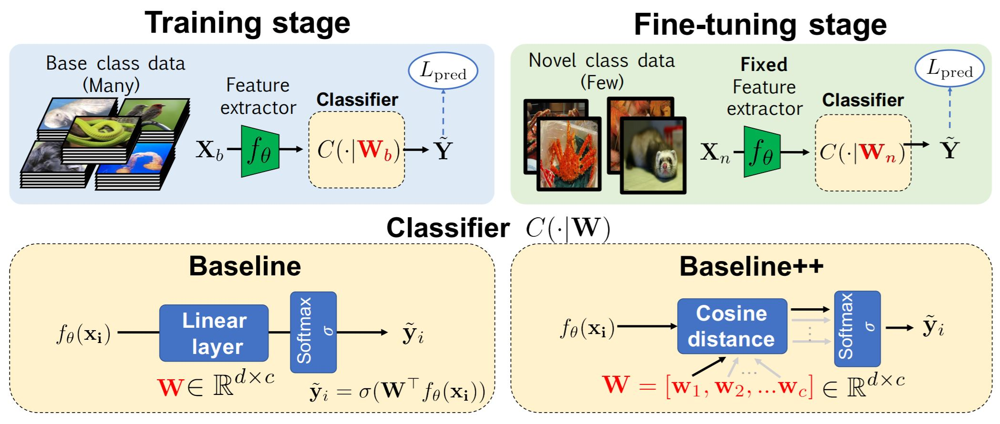
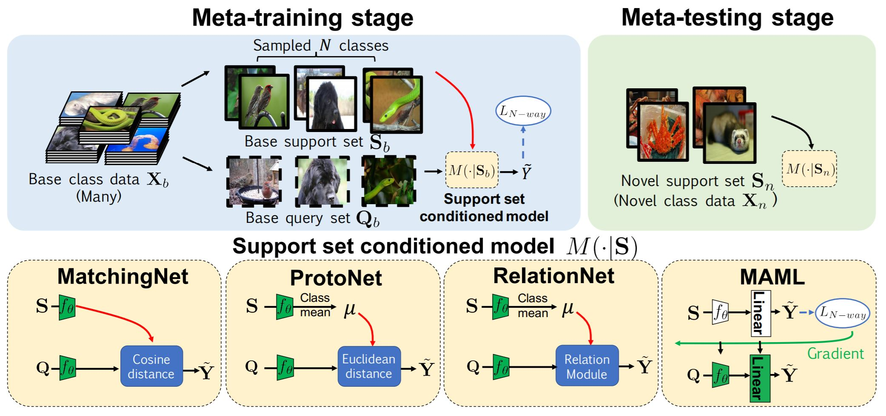
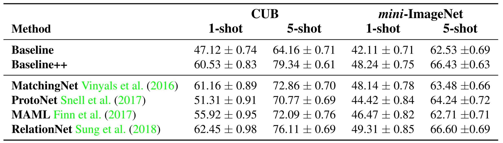
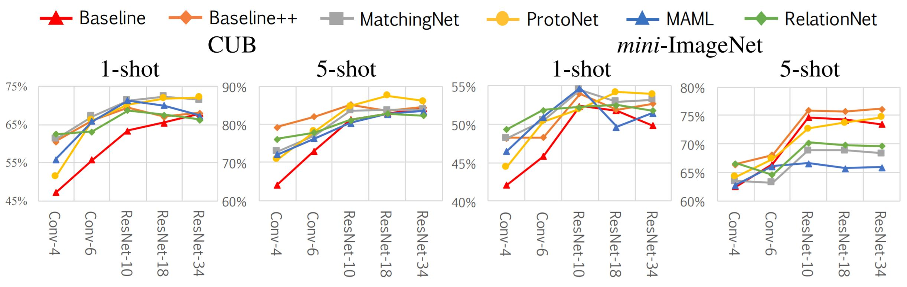
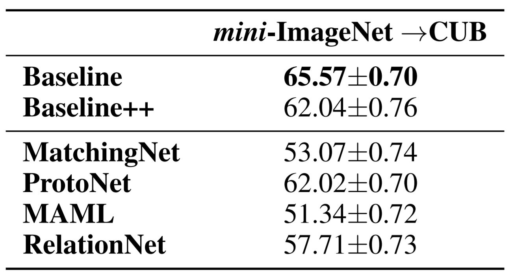
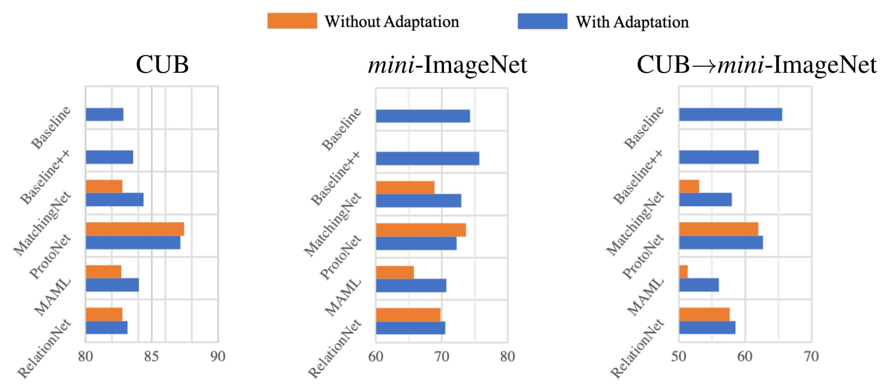

# A Closer Look at Few-Shot Classification

## Introduction

The success of deep learning models in computer vision tasks heavily relies on training networks with abundant labeled instances with diverse visual variations. Human annotation cost as well as scarcity of data in some classes significantly limit applicability of current vision systems. It is thus of great interest to learn to generalize to new classes with limited amount of labeled example for each novel class. In this paper they provide a unified testbed for several different few-shot classification algorithms for fair comparison. Also, they investigated a practical evaluation setting where base classes and novel classes are sampled from different domain.

## Method

1. *Baseline*

- Baseline: 
    - Training: Train from scratch by minimizing standard cross-entropy loss
    - Fine-tuning: Fix feature extractor and train a new classifier
- Baseline++:
    - Calculate cosine similarity to each weight vector
    - Obtain prediction probability with softmax on similarity scores
    - **Reduces intra-class variation among features**

2. *Meta-Learning*

Train on small base support set and query set to learn to learn from small support set.

- MatchingNet:
    - Compares cosine distance between query feature and each support feature
    - Computes average cosine distance for each class
- ProtoNet:
    - Compares Euclidean distance between query feature and class mean of support features
- RelationNet:
    - Similar to ProtoNet, but replaces distance with a learnable realtion module
- MAML:
    - Each support set is used to adapt the initial model parameters using few gradient updates

## Results

Evaluated on commonly used mini-ImageNet and CUB-200-2011 dataset

1. *Evaluation using the Standard Setting*

- Using a 4-layer convolution backbone with 84x84 input size
- Perform 5-way classification for only novel classes during the fine-tuning or meta-testing stage
- **The performance of the Baseline method is severely underestimated**

2. *Effect of Increasing Network Depth*

- On the CUB dataset, as the backbone gets deeper, the gap among different methods drastically reduces
- The result of mini-ImageNet is much more complicated, might due to domain differences, mini-ImageNet have larger divergence than CUB in a word-net hierarchy

3. *Effect of Domain Differences*

- Proposed a new *cross-domain scenario*: mini-ImageNet $\rightarrow$ CUB
- A practical scenario since collecting images from general class may be relatively easy but collecting images from fine-grained classes might be more diffucult

4. *Effect of Further Adaptation*

- Adapt the novel classes by training on it more
- Performance improves in most cases

## Discussion

1. The result of Baseline++ shows that reducing intra-class variation is an important factor in the current few-shot classification problem setting
2. In the CUB dataset, the gap among existing methods would be reduced if their intra-class variation are all reduced by a deeper backbone
3. As the domain difference grows larger, the adaptation based on a few novel class instances becomes more important
4. Learning to learn adaptation in the meta-training stage would be an important direction for future meta-learning research in few-shot classification
5. The result of the paper shows that complicated model obtaining high performance on common datasets might be an illusion (overfitting?), we need to carefully examine each methods on a common ground to get a better view of them