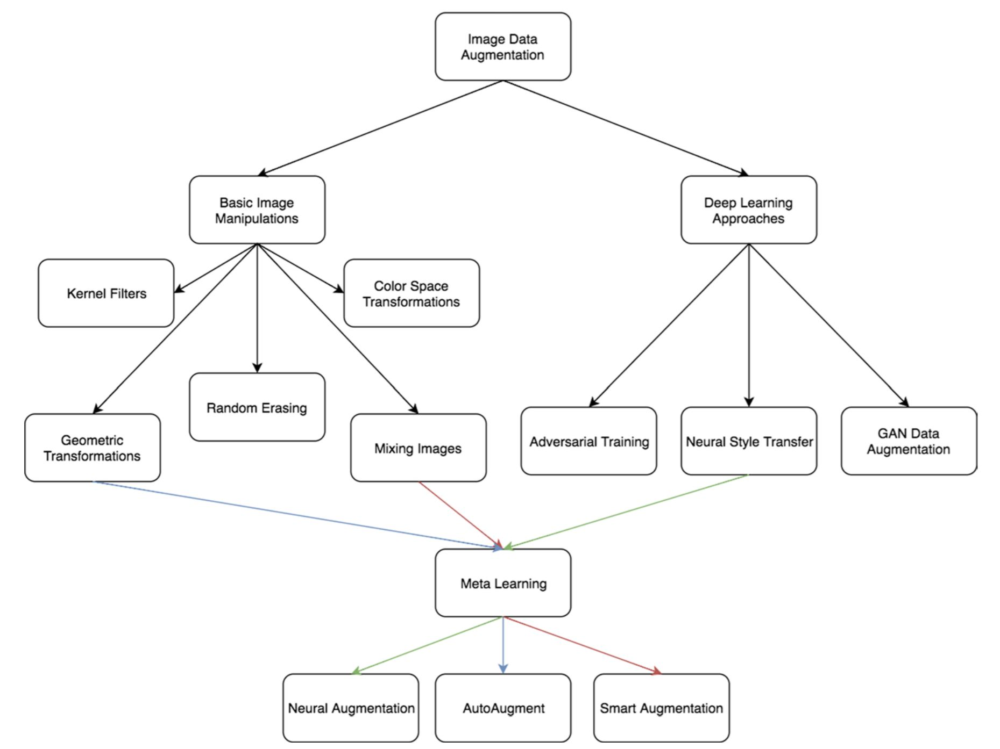

# A survey on Image Data Augmentation for Deep Learning

## Introduction

Data augmentation is a technique that helps preventing overfitting, and also enriches the training data set. This paper surveys a set of common data augmentation techniques along with experiment results.

## Method

1. *Basic image manipulations*
	- Flipping
		- Easiest to implement yet useful
	- Color space
		- Color channel manipulation
		- Color histogram
	- Cropping
		- Will reduce size of image
	- Rotation
		- Different task have different *safety* rotation range
	- Translation
		- Shift images to avoid position bias
		- Fill space with constant value, or Gaussian noise
	- Noise injection
		- Help CNN learn more robust features
	- **Be aware of label preserving when using geometric / color space transformations**
2. *Geometric versus photometric transformations*
	- Kernel filters
		- Basically, kernel is human pre-defined convolution
		- PatchShuffle regularization
	- Mixing images
		- Mix images by copping / patching or simply average intensity
		- Not very intuitive to human, however does show some good results in experiment
	- Random erasing
		- Inspired by dropout, erases some part of image to force network to pay attention to the entire image, rather than just a subset of it
		- Image aware / object aware erasing
3. *Deep Learning*
	- Feature space augmentation
		- Vector representation can be used in any machine learning model
		- Hard to interpret
		- Data-space augmentation will outperform feature-space augmentation, if possible
	- Adversarial training
		- Rival network learns augmentation to fool classification network
		- No improve in test accuracy, but significant improve in test adversarial samples
	- GAN‑based Data Augmentation
		- DCGAN
		- Progressively Growing GAN
		- CycleGAN
		- Conditional GAN
	- Neural Style Transfer
		- Perceptual loss
		- Might introduce bias if style set is too small
	- Meta learning Data Augmentations
		- Neural Augmentation
		- Smart Augmentation
		- AutoAugment

## Results

*Design Considerations*

1. *Test-time augmentation*
	- Increase robustness, but slows down inference time
	- Reduces false positives
2. *Curriculum learning*
	- Selecting data to beat random selecting
	- From easy data to hard data
	- No clear consensus on how to train with augmented data
	- Especially important for One-Shot Learning systems
3. *High resolution impact*
	- Higer resolution give better result, but requires more computation and memory
4. *Final dataset size*
	- Transform data before training (offline)
		- Additional memory to store
	- Transform data on the fly
		- Trains slower
4. *Alleviating  class imbalance*
	- Oversampling with simple geometric transform might cause overfitting 
	- Oversampling with deep learning could better way 

## Discussion

1. Different augmentation techniques ccould be combined and used together, however, be aware of label preseerving
2. Mixing image is not very intuitive, haven't seen much application of it. However, by weighted sum image intensities, we could create intermediate images, for example weighted sum a dog and a cat image with weight [0.7, 0.3], and the label would be [0.7, 0.3] for this image, by doing so, we might be able to create some sort of 'large margin' effect
3. Random erasing also introduces impainting, which is also a very interesting topic
4. Feature space manipulation is actually pretty common in NLP, but seems to be less used in images
5. Using deep learning based augmentation, such as style transfer, or GAN, sounds pretty interesting, but I dn't think is practical yet, since it might introduce more problems
6. Data augmentation helps to extract more information from training dataset (or testing as well), but could not create new images from it, thus, it doesn't help if training data is already biased