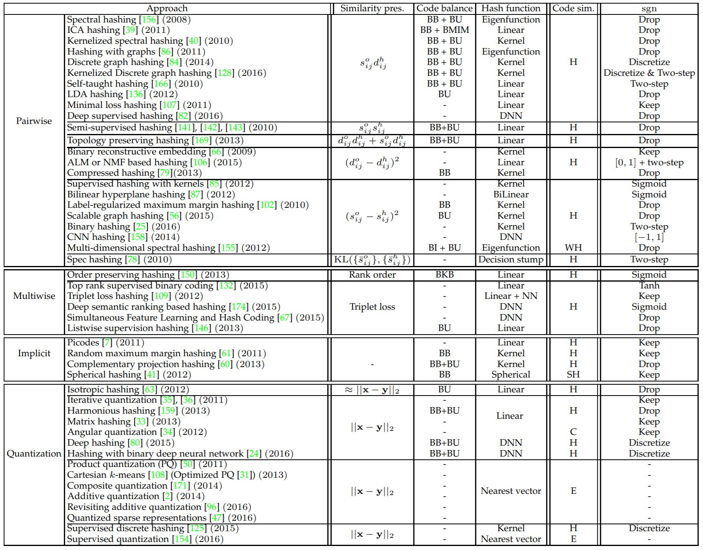
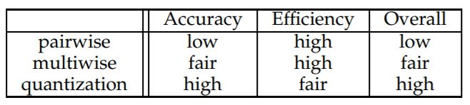

# A Survey on Learning to Hash

## Introduction

This paper presents a comprehensive survey of learning to hash methods, categorize them according to the manners of preserving the similarities. In addition, they present the evaluation protocols, and the general performance analysis, and point out that the quantization algorithms perform superiorly in terms of search accuracy, search time cost, and space cost. Finally, they introduce a few emerging topics.

## Method

- Hash Function
	- Linear projection, kernels, spherical function, (deep) neural networks, a nonparametric function, ...
- Similarity
	- Euclidean distance, cosine similarity, semantic similarity, Hamming distance
- Loss Function
	- Preserve similarity order
	- Pairwise similarity preserving, multiwise similarity preserving, implicit similarity preserving, quantization / reconstruction
- Optimization
	- Relax sign function with sigmoid or tanh
	- Two-step scheme, alternative optimization
	- Discretization, drop the sign function and regard the hash code as an approximation of the hash function
- Categorization
	- This survey categorizes according to what similarity preserving manner is adopted to formulate the objective function
	- Other factors such as the hash function, or optimization algorithm is 

## Results

1. *Summary of Hashing algorithms*

2. *Other Topics*
- Joint Feature and Hash Learning via Deep Learning
	- Almost all non-deep-learning methods could be extended to deep learning framework
- Fast Search in the Hamming Space
	- Multi-index hashing, FLANN, PQTable
- Inverted Multi-Index
	- Hash table lookup, multi-sequence algorithm

3. *Evaluation Protocols*
- Evaluation Metric
	- space cost (code length), search efficiency (time/query), and search quality (Recall@R)
- Evaluation Datasets
	- MNIST, SIFT10K, SIFT1M, GIST1M, Tiny1M, SIFT1B, GloVe1.2M
- Training Sets and Hyper-parameter selection
	- Seperate set / sample subset from reference set / use all reference set for learning hash function
	- When query is transformed to binary code, learning on all reference set might lead to overfitting
	- When the raw query is used without processing, learning on the whole reference set
	- Select hyper-parameter by validation

4. *Performance Analysis*
- Query Performance
	

- Training Time Cost
	- Pairwise: $O(N^2M+N^2d)$
	- Multiwise: generally greater than pairwise
	- Iterative Quantization: $O(Nd^2+NM^2+M^3)$
	- Cartesian k-means: $O(Nd^2+d^3)$
	- Composite Quantization: $O(NKPd+NP^2+P^2K^2d)$

5. *Emergin Topics*
- Speed up the Learning and Query Processes
	- Scalable Hash Function Learning
	- Hash Code Computation Speedup
	- Distance Table Computation Speedup
- Promising Extensions
	- Semantic Quantization
	- Multiple and Cross Modality Hashing

## Discussion

1. Categorizing with similarity preserving method is easier to understand in a high level comparing to using hash function to categorize such as in [Wang et al.](https://arxiv.org/pdf/1509.05472.pdf) ([Summary](./learning_to_hash_for_indexing_big_data-a_survey.md))
2. As mentioned in the paper, most methods could be extended into deep learning framework, which is happening in other research topics as well, extending old methods to deep learning usually leads to good result
3. This paper also discusses about evaluation protocols and performance analysis, helps readers that are not familiar with the area easier to understand the aility of each method