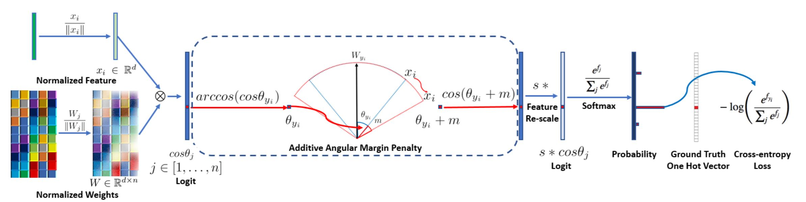

# ArcFace: Additive Angular Margin Loss for Deep Face Recognition

## Introduction

Designing discriminative loss in feature learning using *Deep Convolution Neural Networks* (DCNNs) for large-scale face recognition is a popular research recently. *SphereFace* penalises the angles between the deep features and their corresponding weights in a multiplicative way. This paper introduces an *Additive Angular Margin Loss* to further improve the discriminative power and stabilize the training process. Also, they present an extensive experiment evaluation on all state-of-the-art methods on over 10 benchmarks.

## Method

1. Dot product L2-normalized weight and feature to get $cos\theta$
2. Calculate $arccos\theta$ and get angle between feature and ground truth weight
3. Add angular margin penalty $m$ on target angle $\theta$
4. Calculate $cos(\theta+m)$ and multiply by feature scale $s$
5. Go through softmax and cross-entropy

## Results

1. Easy implementation and could easily converge on any dataset without the need of combining other losses or careful initialization
2. Compared ArcFace margin with SphereFace, CosFace, and the combination of them, the combined margin outperformed SphereFace and CosFace, but upper-bounded by ArcFace
3. Compared ArcFace with other losses that aim at enforcing intra-class compactness and inter-class discrepancy. ArcFace has good intra-class compactness and inter-class discrepancy, while Triplet loss has simillar intra-class compactness but inferior inter-class discrepancy
4. Consistently out performs the state-of-the-art methods on several benchmarks with extensive experiments
5. Manually refined MegaFace dataset

## Discussion

1. The transformation to angular space very innovative (didn't originate from this paper though), we could adapt a lot of good mathematical characteristic from the angular space
2. ArcFace is very simillar to SphereFace and CosFace, all 3 tries to explore the softmax loss in angular space and try to improve discriminative power of the features with margin penalty. CosFace adds margin penalty outside the cosine function, SphereFace multiplies the margin penalty with the angle, and ArcFace adds the margin penalty with the angle. Turns out that directly manipulating the angle is more effective, and additive is better than multiplicative since it has better geometric attribute.
3. The paper performed very extensive experiments evaluation to prove its outstanding performance, along with detailed comarison and discussion. Also, they released all training data, code, model, and logs, which helps a lot for future research
4. In the appendeix, they discussed about if the 512-d representation on the hypershpere is enough for large-scale identities, the hyperspace is so big that the nearest angle decreases slowly while the class number increases exponentially. High dimention representation is used in all sorts of feature learning tasks, from images to audios to texts, many interesting relationships in the high dimention space has been explored, such as the word relationships in word embedding, maybe we could find simmilar relations in face attribute representations as well