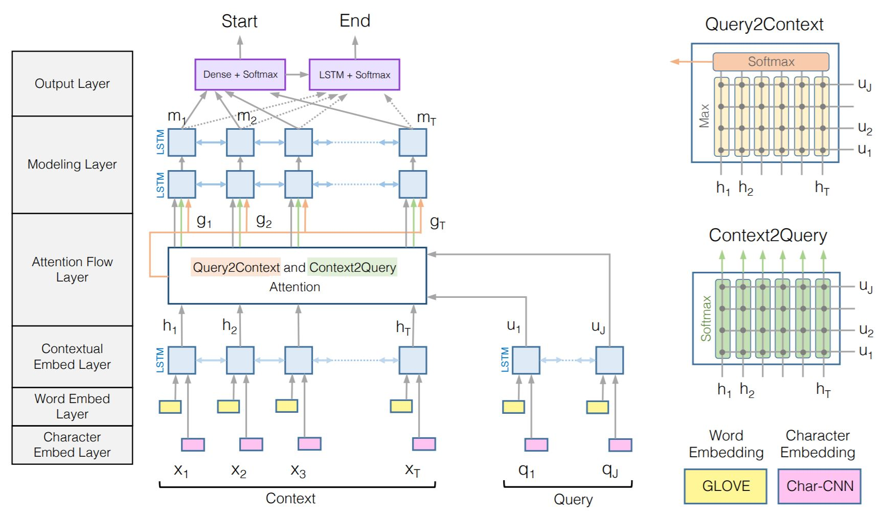
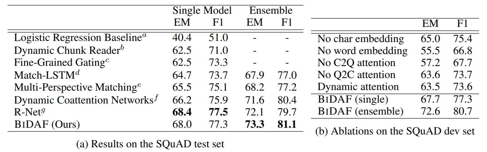
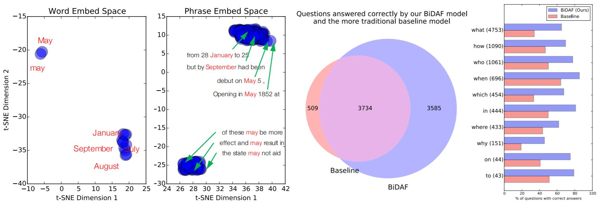
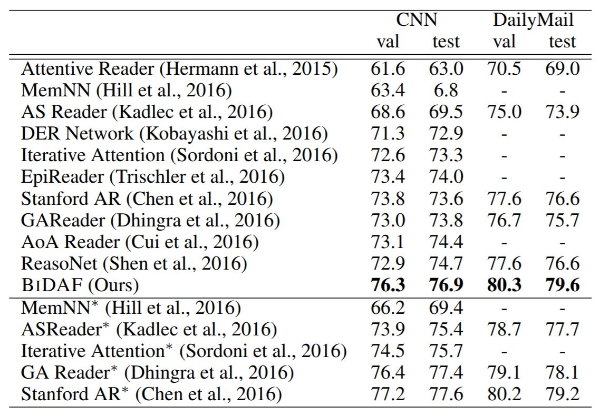

# Bi-Directional Attention Flow for Machine Comprehension

## Introduction

Machine Comprehension (MC), answering a query about a given context paragraph, requires modeling complex relationship between the query and the context. Recently, attention mechanisms have been succuessfully applied to MC. Previous methods use attention to focus on a small portion of the context and summarize it with a fixed-size vector, couple attention temporally, often form a uni-direction attention. In this work, they proposed a bi-directional attention and acheived state-of-the-art performance on SQuAD dataset and CNN/DailyMail cloze test.

## Method

1. *Character Embed Layer*
- Use a character-level CNN to map each word to high-dimensional space
2. *Word Embed Layer*
- Use pre-trained word vector (GloVe) to map each word to high-dimensional space
3. *Contextual Embed Layer*
- Use a bi-LSTM to obtain contexual embedding
4. *Attention Flow Layer*
- Context2Query attention signifies which query words are most relevant to each context word
- Query2Context attention signifies which context words have the closest similarity to one of the query words and are hence critical for answering the query
- Memory-less, will not be affected by previous incorrect attentions
5. *Modeling Layer*
- 2 layer bi-LSTM to get query-aware representations of context words
6. *Output Layer*
- Application specific
- In QA task, predict probablity of starting position and ending position in context
7. *Training/Testing*
- Use sum of negative log probablities of start/end position for loss in training
- In testing, calculate probabilty for all possible answer span, could be computed in linear time with dynamic programming

## Results

1. *Question Answering Experiments*

- Outperforms previous approaches
- Both character-level and word-level embedding contribute to the performance
- Word-level embedding is better at preserving semantics of each word, while character-level handles out-of-vocabulary (OOV) and rare words better

- t-SNE visualization of each feature space
- Interesting discovery that may behaves differently to other months due to multiple meanings of it

2. *Cloze Test Experiments*

- Even single model outperforms previous ensemble methods

## Discussion

1. Every component in the model is meaningful and very intuitive, and from analyzing the results qualitively, we could see that each components indeed help the model's performance
2. The visualization is interesting, and gives us a idea about how the feature space is like, and how to interpret it
3. The contextual embedding layer and modeling layer are quite simillar, but the modeling layer captures query-aware representations while the other doesn't
4. They use both the contextual embedding and the attensions as input of the modeling layer to reduce loss from only summarizing with attension
5. I don't quite understand why character-level embedding would be helpful, in the paper, they "conjecture" that it helps OOV and rare words, however, it's quite hard to convince me that looking at each character is helpful to realize unknown words. They did analyze it and found that the character-level embedding helped the model's performance, but how to explain it needs more discussion