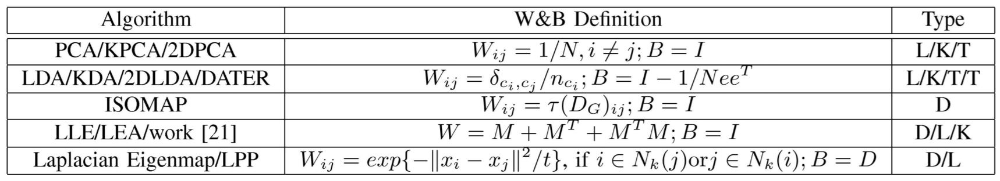

# Graph Embedding and Extensions: A General Framework for Dimensionality Reduction

## Introduction

Dimension reduction have drawn much attention in computer vision and pattern recognition. This paper presents a general framework called graph embedding that offers a unified view for understanding and explaining many popular dimensionality reduction algorithm. Another contribution of this paper is to show that graph embedding framework can be used as a general platform for developing dimensionality reduction algorithms. They also developed a novel dimensionality reduction algorithm, **Marginal Fisher Analysis (MFA)** to overcome some limitation of previous algorithms.

## Method

1. *Graph Embedding*
- Intristic graph & Penalty graph
- Direct Graph Embedding (D)
	- $y^* = \arg \min\limits_{y^TBy=d} \sum\limits_{i \neq j} ||y_i - y_j||^2W_{ij}=\arg \min\limits_{y^TBy=d} y^TLy$
	- $B$ is the contraint matrix to avoid trivial solution
	- $B$ is typically a diagonal matrix for scale normalization and may also be the Laplcian matrix of a penalty graph $G^p$
- Linearization (L): $y=X^Tw$
	- $w^* = \arg \min\limits_{\substack{w^T XBX^Tw=d \\ or\space w^Tw=d} } \sum\limits_{i \neq j} ||w^Tx_i - w^Tx_j||^2W_{ij}=\arg \min\limits_{\substack{w^T XBX^Tw=d \\ or\space w^Tw=d} } w^TXLX^Tw$
- Kernelization (K): $w=\sum_i\alpha_i\phi(x_i)$, $K_{ij}=\phi(x_i)\cdot\phi(x_j)$
	- $\alpha^* = \arg \min\limits_{\substack{\alpha^T KBK^T\alpha=d \\ or\space \alpha^TK\alpha=d} } \sum\limits_{i \neq j} ||\alpha^TK_i - \alpha^TK_j||^2W_{ij}=\arg \min\limits_{\substack{\alpha^T KBK^T\alpha=d \\ or\space \alpha^TK\alpha=d} } \alpha^TKLK^T\alpha$
- Tensorization (T): $y_i=\textbf{X}_\textbf{i}\times_1w_1\times_2w_2...\times_nw_n$
	- $(w_1, ..., w_n)^*=\arg\min\limits_{f(w_1, ..., w_n)=d}\sum\limits_{i \neq j}||\textbf{X}_\textbf{i}\times_1w_1\times_2w_2...\times_nw_n - \textbf{X}_\textbf{j}\times_1w_1\times_2w_2...\times_nw_n||W_{ij}$
	- No closed-form solution but can obtain the solution with closed-form manner by fixing other projection vectors and the local optimum can be obtained by optimizing different projection vectors iteratively

2. *Marginal Fisher Analysis*
- Algorithm
	- **PCA Projection**: 
		- First project the data set into PCA subspace
		- Retain $N-N_c$ dimensions or a certain energy
	- **Constructing the intraclass compactness and interclass separability graphs**: 
		- In intraclass compactness graph, set the adjacency matix if $x_i$ is among the $k_1$-nearest neightbor of $x_j$
		- In interclass separability graph, set the adjacency matix if the pair $(i, j)$ is among the $k_2$-shortest pair 
	- **Marginal Fisher Criterion**
		- $w^*=\arg\min\limits_w\frac{w^TX(D-W)X^Tw}{w^TX(D^p-W^p)X^Tw}$
		- Special linearization  of the graph embedding framework wit $B=D^p-W^p$
	- **Final Linear Projection Direction**
		- $w=W_{PCA}w^*$
- More available project direction than LDA
- No assumption on data distribution
- Could extend to kernelization and tensorization

## Results

1. *General Framework*

2. *Marginal Fisher Analysis*
Use face recognition to evaluate proposed MFA, KMFA, TMFA
- MFA vs. Fisherface
	- Consistently performs better than Fisherface
- Evaluation of Graph Embedding Framework
	- Kerel trick can improve face recognition accuracy
	- LPP outperforms Fisherface when training set adequately characterizes the data distribution, but loses when the training set is complex and cannot represent the data distribution well.
	- Performance can be substantially improved by exploring a certain range of PCA dimensions
	- Bayesian Face performs better than PCA, Fisherface and LPP in most cases
	- Tensor representation brings encouraging performance improvements
	- When the training sample size is large enough to sufficiently characterize the data distribution, all algorithm can achieve similar performance
- Non-Gaussian Case
	- LDA may fail to find the optimal direction, whereas MFA can find an a more discriminative direction

## Discussion

- The graph embedding frame work here is similar to graph convolution neural networks, the ideas here should be able to transfer to neural networks as well
- With sufficient training data, almost every method could achieve similar performance, however, we almost could never get sufficient data in real world applications, how to utilize insufficient data to get reasonable result is an important problem
- Kernelization and Tensorization boost the performance by quite some margin, these techniques could be applied to other research area as well