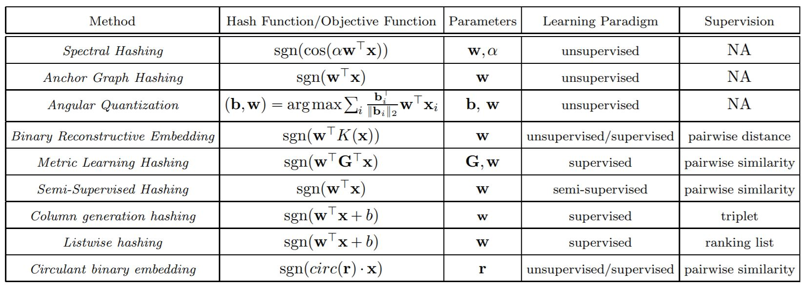
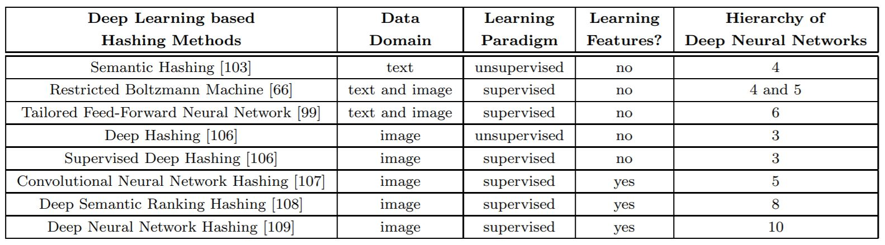

# Learning to Hash for Indexing Big Data - A Survey

## Introduction

The explosive grow in big data has attracted much attension on designing efficient indexing and searching methods. Approximate Nearest Neighbor (ANN) search based on hashing techniques has bocome popular due to its efficiency and accuracy. This work provides a comprehensive survey of hashing frameworks, as well as recent deep learning based approaches. 
## Method

1. *Pipeline of Hash-based ANN search*
- Designing hash function
- Indexing using hash tables
- Online querying with hash

2. *Categories*
- Data Dependent / Data Independent
- Supervised / Semi-supervised / Unsupervised
- Pointwise / Pairwise / Triplet-wise / Listwise
- Linear / Nonlinear
- Single-shot Learning / Multiple-shot Learning
- Weighted Hashing / Non-weighted Hashing

3. *Method review and analysis*
- Spectral hashing
	- Apply sinusoidal function with pre-computed angular frequency to partition data along PCA directions
- Anchor Graph Hashing
	- Use a small set of anchors such that similarity between any pair of points can be approximated using point-to-anchor similarities
- Angular Quantization Based Hashing
	- Assign normalized data point to closest hypercube vertex
- Binary Reconstructive Embedding
	- Minimize a cost function measuring the difference between the metric and reconstructed distance in hamming space
- Metric Learning based Hashing
	- Learn a parameterized Mahalanobis metric using pairwise label information
- Semi-Supervised Hashing
	- Design hash function with minimum empirical on small set of labeled data while maintaining maximum entropy over the entire dataset
- Column Generation Hashing
	- Explore large-margin framework to design weighted hash functions
- Ranking Supervised Hashing
	- Presereve the ranking list in Hamming space
- Circulant Binary Embedding
	- Use circulant projection to avoid high computational and storage costs for high-dimensional data

4. *Deep Learning for Hashing*
- Semantic Hashing
	- Stack of Restricted Boltzmann Machines (RBMs)
- Deep RBM
	- Idea from nonlinear Neighbourhood Component Analysis (NCA) embedding 
- Sparse Similarity-Preserving Hashing
	- Enforcing sparsity into the hash codes to be learned from training examples with pairwise supervised information
- Deep Hashing
	- Maps original images to compact binary hash codes
	- Reconstruction error, balaned bits, independent bits
- Supervised Deep Hashing
	- A discriminative term incorporating pairwise supervised information is added to the objective function of the deep hashing model 
- Convolutional Neural Network Hashing
	- Integrate image feature learning and hash value learning into a joint learning model
- Deep Semantic Ranking Hashing 
	- Learn hash values such that multilevel semantic similarities among multi-labeled images are preserved
- Deep Neural Network Hashing
	- Image representation and hash values are learned in one stage so that representation learning and hash learning are tightly coupled to benefit each other

5. *Advanced Methods and Related Applications*
- Hyperplane Hashing
	- Very different to point-to-point hashing
	- Important to many machine learning applications
- Subspace Shahing
	- Efficiently search through a large database of subspaces
- MultiModality Hashing
	- Closely related to the applications in social network,  where multimodality and heterogeneity are often observed
- Applications with Hashing
	- Indexing massive multimedia data, such as images and video
	- Image patch matching, image classification, face recognition, pose estimation, object tracking, and duplicate detection 
	- General machine learning and data mining tasks, including crossmodality data fusion, large scale optimization, large scale classification and regression, collaborative filtering, and recommendation 

## Results

## Discussion

1. Most randomized hash function based have presented theoretical analysis on collision probability but lack the guarantee of quality neighbors returned 
2. Could we directly use the compact code after hashing to train models without accuracy loss
3. Hashing techniques often suffer from semantic gap, integrate representation learning with binary code learning in advanced learning schemes might be a direction for the future
4. In a previous project in my lab, we found a paper about fine-grained object detection and recognition, in the paper, they've used hashing to speed-up inference, however, there is a huge performance gap when running on our own data. This is similar to the problem of open-set prblem in our homework, we get good results on some dataset, but then gets considerbly worse result on other datasets, how do we reduce such performance gap? Or could we get a general hashing method that is feasible on all (most) domains?
