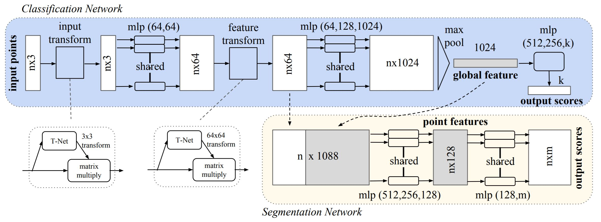

# PointNet: Deep Learning on Point Sets for 3D Classification and Segmentation

## Introduction

Poing cloud is a type of 3D object data structure. Due to its irregular format, previous works would transform such data into 3D voxel grids or collection of images, however, such method might introduce quantization artifacts that can obscure natural invariances of the data. This paper proposes PointNet, which directly uses the raw data of point cloud (that is, the x, y, z coordinates of all points), adn has shown strong performance and robustness to input perbutation and corruption.

## Method

1. *Classification*
- Multi-layer perceptron (MLP) to approximate a general function
- T-Net predicts an affine transform and transforms input point
	- Point independent feature extraction
	- Get feature invariant to geometric transformation
- Max-pooling as a symmetric function to aggregate information from all points
	- To solve the problem of unordered input points
	- Sorting is not possible in high dimensional space
	- Train RNN with permutation augmentation is not scalable to thousand of input element (which is common in point clouds)
2. *Segmentation*
- Aggregate local feature and global feature (simply concatenate them)
- Run through another MLP to predict segmentation

## Results

1. *3D object classification*: 
- Acheived state-of-the-art performance among methods based on 3D input
2. *3D object part segmentation*: 
* Beat most categories and has a 2.3% improvement in mean IoU in ShapeNet part data set
3. *Semantic segmentation in scenes*: 
- Out perform state-of-the-art method by a large margin on the Stanford 3D semantic parsing data set
4. *Robustness test*: 
- With 50% points missing, the accuracy only drops 2-4%
- More than 80% accuracy when 20% of the points are outliers
5. *Time and space complexity analysis*:
- Orders more efficient in computation cost
- Space and time complexity is O(N) in the number of input points, **scalability**! 
	- Convolution dominates computing time
	- Multi-view method time complexuty grows squarely on image resolution
	- Volumentric convolution grows cubically with the volume size

## Discussion

1. Directly learn on raw data (point cloud) get better result, showing powerfulness of end-to-end training
2. The T-Net is simmilar to spatial transformer networks (STN) by  [Jaderberg et al., NIPS 2015](https://papers.nips.cc/paper/5854-spatial-transformer-networks.pdf), this techniques seem to be able to be applied in several scenarios, such as OCR and the PointNet proposed in this paper
3. [Wang et al., CVPR 2018](https://arxiv.org/pdf/1801.07829.pdf)[[summary](../GCN/dynamic_graph_cnn_for_learning_on_point_clouds.md)] uses graph convolution networks to further capture local feature from nearby points, which resulted in better classification and scene segmentation results.