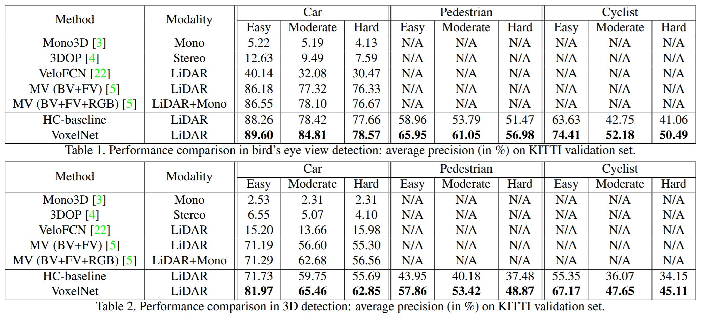

# VoxelNet: End-to-End Learning for Point Cloud Based 3D Object Detection

## Introduction

Point cloud based 3D object detection is an important component of several real-world application, such as self-driving cars or VR/AR application. Most previous methods require hand-craft feature or multi-view images. In this work, they present VoxelNet, which trains an end-to-end model directly on raw point cloud data for 3D object detection.

## Method

1. *Feature Learning Network*
- Subdivide the 3D space into equally spaced voxels
- Group points according to the voxel they reside in
- Random sample *T* points if a voxel contains more than *T* points
	- Computation savings
	- Decrease imbalance of voxels
	- Add more variation to training
- Stacked Voxel Feature Encoding
	- Use coordinate and the offset of it to the local mean as input feature
	- Pass through fully connected layers and transfor to feature space
	- Use element-wise max-pooling to get the final voxel-wise feature
- *Sparse Tensor Representation*
	- Only process non-empty voxels
	- More than 90% of voxels are empty 
	
2. *Convolution Middle Layers*
- 3D convolution with batch normalization layers and ReLU layer

3. *Region Proposal Network*
- Classification subnet
- Regression subnet

4. *Loss Function*
- Combination of classification and regression loss
- Classification loss is weighted sum of positive and negative anchors

5. *Data Augmentation*
- Perbutation
- Scaling
- Rotation

## Results

Outperform previous state-of-the-art method with only the LiDAR data

## Discussion

1. Another example of the powerfulness of end-to-end-training
2. How to decide the size of voxels, threshold for random sampling and weight for loss isn't discussed in the work, which differs in different experiment, how to set the hyper-parameters properly might be a big problem in real-world application
3. Inference time on TitanX GPU and 1.7Ghz CPU is about 225ms which might not be fast enough for some application such as self-driving cars